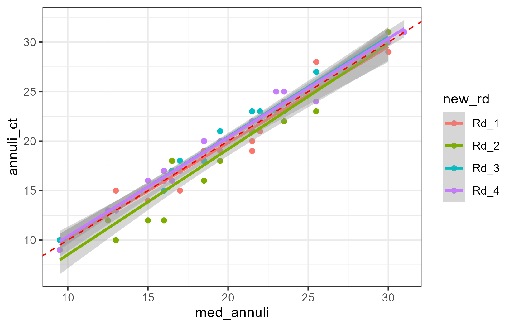

{fig-align="center"}

# Introduction

Pacific spiny dogfish are aged using the posterior dorsal fin spine. Because these spines get worn or broken over time, the number of missing annuli must be estimated. Numerous studies have explored this "worn annuli algorithm" (e.g., Ketchen, Tribuzio et a. ) and other have attempted to either improve the worn annuli algorithm (Cheng) or find alternative ageing structures (Bubley et al., Tribuzio et al.). Ultimately, the posterior dorsal spine approach has been retained as the best method. Further, ages generated from the posterior dorsal fin spine with estimation of worn annuli using the Ketchen approach have been validated with 14C (Campana et al. 2006).

For NPRB2301, we use the posterior dorsal fin spine method to provide ages for the Pacific spiny dogfish in this study. This method breaks down into two stages: reading the spines, then estimation of the worn annuli.

# Methods

Spines were prepared and read following the procedures detailed in [Tribuzio et al. 2017](https://spo.nmfs.noaa.gov/content/mfr/methods-preparation-pacific-spiny-dogfish-squalus-suckleyi-fin-spines-and-vertebrae-and). The spines were read by three readers involved with the project, and also the Washington Department of Fish and Wildlife age reading unit. The WDFW age reading unit is currently considered the authority on Pacific spiny dogfish age reading. Worn annuli were estimated using the parameters from [Tribuzio et al. 2010](https://spo.nmfs.noaa.gov/content/age-and-growth-spiny-dogfish-squalus-acanthias-gulf-alaska-analysis-alternative-growth). 

There is uncertainty in these age estimates and to account for this, we incorporated uncertainty at three steps of the process to estimate confidence intervals around the final age estimates. There are three sources of uncertainty that were simulated 1000 times for each spine. The annuli counts for each simulation were based on a triangular distribution between the minimum and maximum annuli count with the WDFW value as the peak. Measurement error in the last readable point was treated as a normal distribution around the mean LRP with the minimum and maximum as the bounds. Lastly, the parameters for the worn annuli algorithm were also treated as normally distribute based on the values from [Tribuzio et al. 2010](https://spo.nmfs.noaa.gov/content/age-and-growth-spiny-dogfish-squalus-acanthias-gulf-alaska-analysis-alternative-growth), Table 3. The Weighted ordinary least squares model with the back calculated diameter data was the best fit and those parameters were applied to the spines from this study.

The estimated birth year, with uncertainty range, was estimated by subtracting the estimated age from the haul year.

# Results

```{r setup}
#| echo: false
#| warning: false
#| output: false

# Setup ----
libs <- c("tidyverse", "janitor", "googlesheets4", "broom", "EnvStats")
#, "Hmisc", "RColorBrewer", "gridExtra", "gtable", 
#          "grid", "flextable", "officer", "lubridate", "RODBC", "DBI", "gtable", "patchwork")
if(length(libs[which(libs %in% rownames(installed.packages()) == FALSE )]) > 0) {
  install.packages(libs[which(libs %in% rownames(installed.packages()) == FALSE)])}
lapply(libs, library, character.only = TRUE)
'%nin%'<-Negate('%in%') #this is a handy function
round_any = function(x, accuracy, f=round){f(x/ accuracy) * accuracy}

# Bring in data ----
# sample data (e.g., eyes, embryos)
#samp_dat <- read_sheet('1pbSRX_9vj3Xe3_vqK_psvamk18oGSH3Kb-R6NeVSQkc') %>% clean_names() %>% 
#  filter(sample_type %in% c('Spine_P')) %>% 
#  select(-notes_some_got_out_of_order)
# lookup table for joining samples and specimens
samp_spec_join <- read_sheet('1pbSRX_9vj3Xe3_vqK_psvamk18oGSH3Kb-R6NeVSQkc', sheet = 'Sample_Join') %>% clean_names()
# specimen data (i.e., animal that the samples came from)
spec_dat <- read_sheet('1J3IKrdptj7eS3VZj_qbxXTXorgktHXnQ_gUv1mVaxwk') %>% clean_names() %>% 
  filter(species_common_name %in% c("Spiny Dogfish"))
# spine data
spine_dat <- read_sheet('1m4smKQZMS8J7fq_oNQXpZp5_J6K5qaMiJn8W_ULUK_I') %>% clean_names() %>% 
  filter(spine_type == "posterior")

# join specimen and spine data ----
df_age <- spec_dat %>% 
  left_join(samp_spec_join) %>% 
  left_join(spine_dat) %>% 
  filter(!is.na(reader)) %>% 
  select(-c(read_order, date_read, candle, spine_p, embryo_1, embryo_2, eye_l, eye_r, rank))

# Define if spine is worn ----
# based on McFarlane and King 2009 embryo EBD at birth = 2.45 mm
df_age <- df_age %>% 
  mutate(worn = if_else(lrp_mm < 2.45, 1, 0))

# data summary ----
df_summ <- df_age %>% 
  group_by(specimen_id, sex, large_marine_ecosystem) %>% 
  summarise(TL_cm = mean(length_cm)) %>% 
  ungroup()

ndf <- df_summ %>% 
  count()

ndf_TL <- df_summ %>% 
  filter(!is.na(TL_cm)) %>% 
  count()

min_tl <- min(df_summ$TL_cm, na.rm = T)
max_tl <- round(max(df_summ$TL_cm, na.rm = T), 1)

# Comparison between readers ----
med_age <- df_age %>% 
  group_by(specimen_id, sample_id) %>% 
  summarise(med_annuli = median(annuli_ct))

WD_age <- df_age %>% 
  filter(reader == "WDFW_final")%>% 
  select(specimen_id, annuli_ct) %>% 
  rename(authority = annuli_ct)

df_age <- df_age %>% 
  left_join(med_age) %>% 
  left_join(WD_age) %>% 
  mutate(new_rd = if_else(reader == "Matta", "Rd_1",
                          if_else(reader == "Springer", "Rd_2",
                                  if_else(reader == "Tribuzio", "Rd_3", "Rd_4"))))

rd_diff_med <- df_age %>%
  group_by(reader) %>%
  nest() %>%
  mutate(
    test = map(data, ~ t.test(.x$annuli_ct, .x$med_annuli, paired = T, alternative = 'two.sided')),
    tidy  = map(test, tidy),
    glance = map(test, glance)
  )

rd_diff_med_glance <- rd_diff_med %>%
  select(reader, glance) %>%
  unnest(glance)

rd_diff_WD <- df_age %>%
  group_by(reader) %>%
  nest() %>%
  mutate(
    test = map(data, ~ t.test(.x$annuli_ct, .x$authority, paired = T, alternative = 'two.sided')),
    tidy  = map(test, tidy),
    glance = map(test, glance)
  )

rd_diff_WD_glance <- rd_diff_WD %>%
  select(reader, glance) %>%
  unnest(glance)

f1 <- ggplot(df_age, aes(x = med_annuli, y = annuli_ct, color = new_rd))+
  geom_point()+
  geom_smooth(method = "lm", level = 0.95)+ # Adds the line and 95% confidence interval
  geom_abline(slope = 1, intercept = 0, color = "red", linetype = "dashed")+
  theme_bw()

ggsave(plot = f1, 
       filename = paste0(getwd(), "/Fig1_rdcomp.png"),
       dpi = 300)

```

```{r uncertainty}
#| echo: false
#| warning: false
#| output: false

unq_key <- unique(df_age$specimen_id)
WA <- function(x) {floor(rand_b0*(x ^ rand_b1))} 

loop_out <- as.data.frame(matrix(ncol = 4, nrow = length(unq_key)))
colnames(loop_out) <- c("specimen_id", "age_est", "lowerCI", "upperCI")

for (i in 1:length(unq_key)){
  loopdat <- df_age %>% 
    filter(specimen_id == unq_key[i])
  if(nrow(loopdat) == 1){
      loop_out[i,1]  <- unq_key[i]
      loop_out[i,2] <- loopdat$annuli_ct
      loop_out[i,3] <- loopdat$annuli_ct
      loop_out[i,4]  <- loopdat$annuli_ct
  } else {
    rand_ann <- round(rnorm(1000, mean = mean(loopdat$annuli_ct, na.rm = T), sd = sd(loopdat$annuli_ct, na.rm = T)), 0)
    rand_LRP <- round(rnorm(1000, mean = mean(loopdat$lrp_mm, na.rm = T), sd = sd(loopdat$lrp_mm, na.rm = T)), 2)
    rand_b0 <- round(rnorm(1000, mean = 0.212, sd = (0.224-0.212)/1.96), 3)
    rand_b1 <- round(rnorm(1000, mean = 2.856, sd = (2.898-2.856)/1.96), 3)
    lost_ann <- WA(rand_LRP)
    loop_age <- rand_ann + lost_ann -2
    loop_out[i,1]  <- unq_key[i]
    loop_out[i,2] <- round(mean(loop_age), 0)
    loop_out[i,3] <- round(quantile(loop_age, 0.025), 0)
    loop_out[i,4]  <- round(quantile(loop_age, 0.975), 0)
      }
}

df_age <- df_age %>% 
  left_join(loop_out) %>% 
  group_by(sample_id, specimen_id, species_common_name, sex, length_cm, length_type, large_marine_ecosystem, haul_date_akt, noncon_lat, 
           noncon_long, haul_year, nmfs_area) %>% 
  summarise(est_age = median(age_est, na.rm = T),
            age_low = median(lowerCI, na.rm = T),
            age_high = median(upperCI, na.rm = T)) %>% 
  mutate(birthyr_est = haul_year - est_age,
         byr_lower = haul_year - age_high,
         byr_upper = haul_year - age_low)

# write to google drive ----
glink <- "https://docs.google.com/spreadsheets/d/1vSwK6RotLo52VmTlqGsSaYjwvUTYKpq989liY06V87g/edit?gid=0#gid=0"
df_age %>% write_sheet(ss = glink, sheet = "dogfish_spine_ages")
```

All of the Pacific spiny dogfish sampled for this study were adult females. There were `{r} ndf` that were aged, `{r} ndf_TL` with associated length data, ranging in size from `{r} min_tl` to `{r} max_tl` cm total length. None of the readers were significantly different from the median of the four readers (@fig-F1). All of the spines were considered worn, meaning that the LRP >= 2.45. The final age estimates and birth years, with uncertainty ranges can be found in [NPRB2301_dogfish_spine_ages](https://docs.google.com/spreadsheets/d/1vSwK6RotLo52VmTlqGsSaYjwvUTYKpq989liY06V87g/edit?gid=1736666004#gid=1736666004)

# Figures

{#fig-F1}