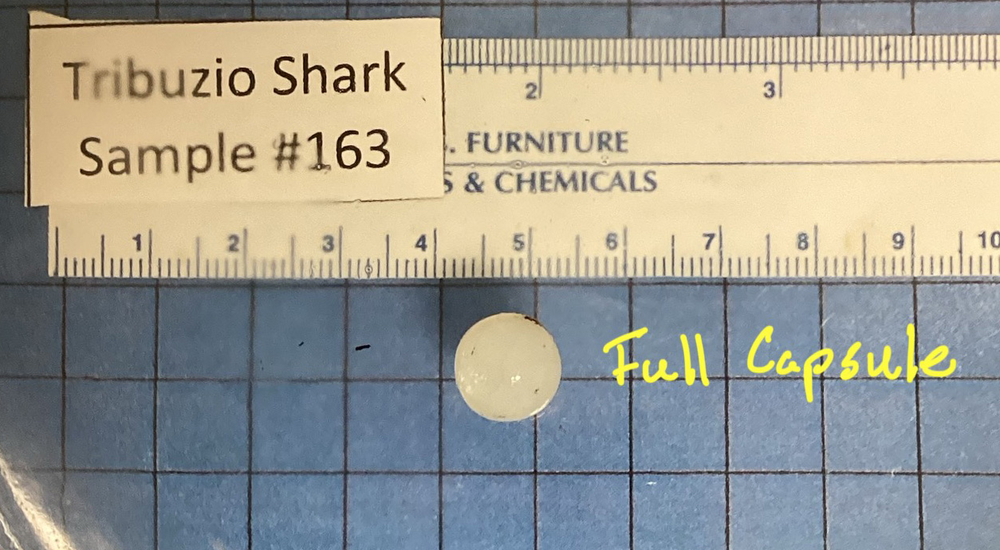
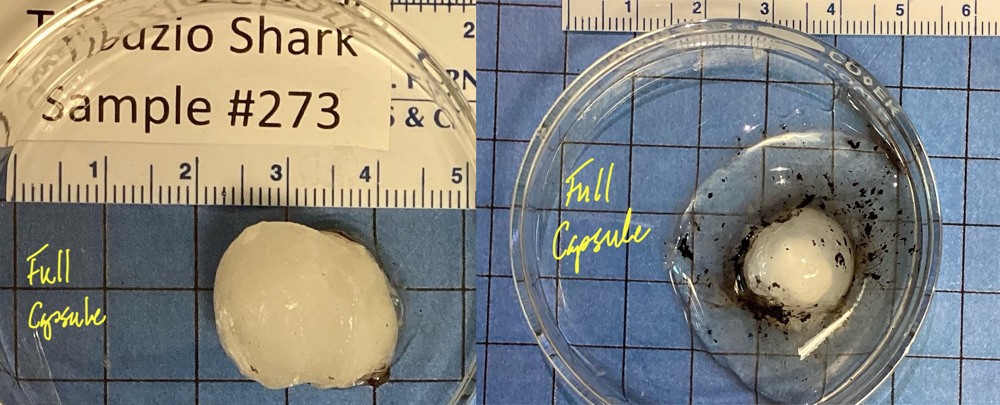
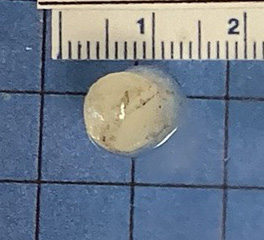
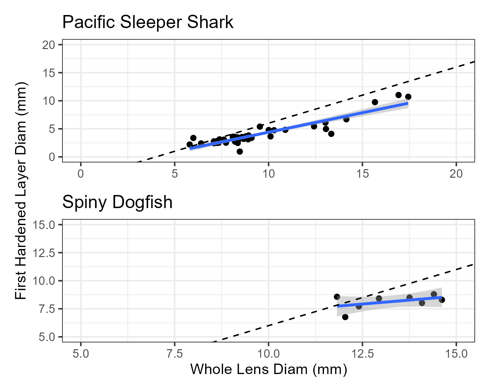
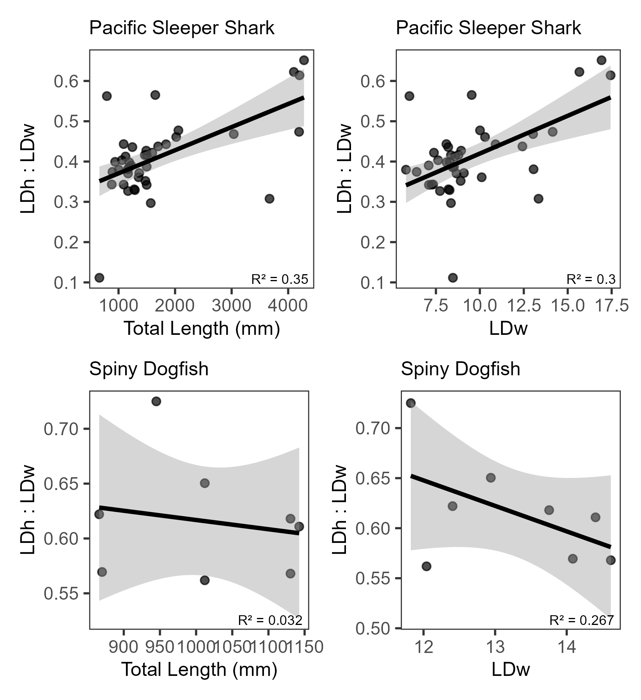
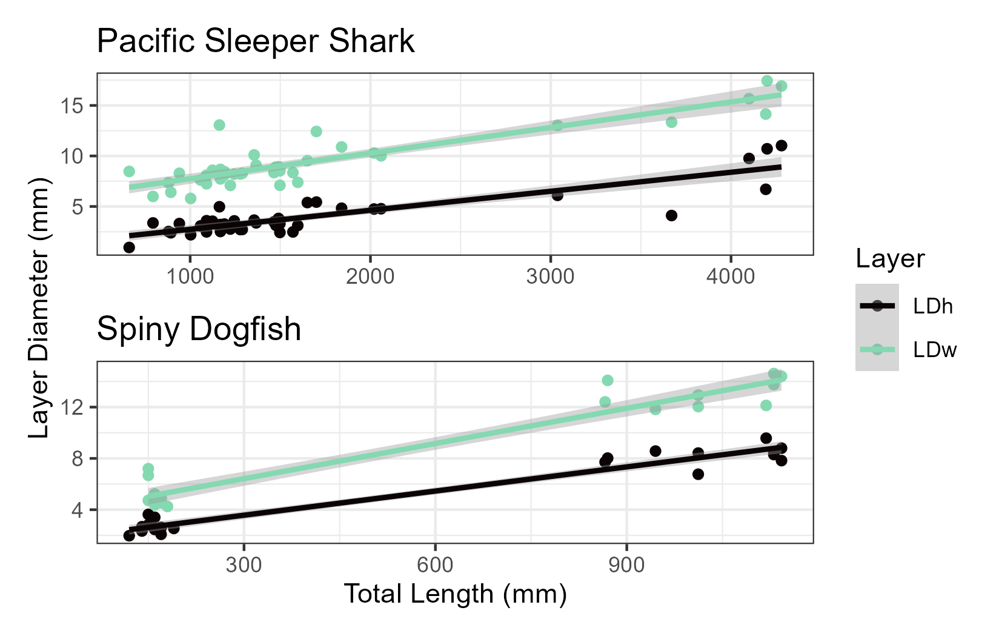

{fig-align="center"}

# Objective

The purpose of this analysis is to estimate body size of Pacific sleeper sharks and Pacific spiny dogfish from images of sequentially peeled eye lenses, based on the presumed linear relationship between eye lens diameter and total body length. The estimation of body size at the time of formation of each lens layer analyzed for delta C-14 and stable isotope composition is intended to facilitate estimation of growth rates and life history reconstruction of individual sharks.

# Introduction

Vertebrate eye lenses grow continuously throughout life, adding sequential layers around an embryonic core over time. Other researchers have demonstrated linear relationships between the fish eye lens diameter and total length, including for the elasmobranchs porbeagle shark *Lamna nasus*, Atlantic spiny dogfish *Squalus acanthias*, thorny skate *Amblyraja radiata*, round ray *Rajella fyllae*, and leopard sharks *Triakis semifasciata* (Quaeck-Davies et al. 2018; Leifsdottir and Campana 2023; Kuntz 2025). In this subanalysis, we describe the relationship between whole lens diameter and the diameter of the hardened portion of the lens to the total length of Pacific sleeper sharks *Sominosus pacificus* and Pacific spiny dogfish *Squalus suckleyi* to estimate the total length at the time of formation of each peeled eye layer in order to link delta C-14 and stable isotope values to body size.

# Methods

## Imaging and measurements

Eye lenses were dissected from frozen eye globes and photographed against a 10 x 10 mm grid background to spatially calibrate images for measurements (@fig-F1). For most individuals, a photograph was taken of the whole, intact lens and of the lens following each sequential peel to a small central nucleus. Eye lenses differed in appearance. While the majority of whole lenses were spherical, a few were oblong in shape; many appeared firmer and more opaque, whereas other lenses were surrounded with a clear jelly layer (@fig-F2). Measurements were generally taken through the equator at the widest point of the solid lens, unless the capsule was clearly beginning to delaminate from the rest of the lens. In those cases, the lens was measured where it appeared most spherical (@fig-F3). Some lenses were too irregular to measure. The condition of the lens was noted when taking measurements. All measurements were made using ImagePro v.10-11 (Media Cybernetics) and converted from pixels to mm in R statistical computing software.

## Comparison of capsule diameter to the diamter of the first hard layer

The outermost layer of the whole lens is termed the “capsule”. Just medial of the capsule is a layer of jelly-like cuboidal epithelial cells, followed by hardened layers composed of crystalline proteins (Kuntz et al. 2025, Quack-Davies et al. 2018). Studies have suggested that the ratio of the whole lens diameter (*LD~w~*) and the first hardened layer (*LD~h~*) is consistent across the life of the fish, regardless of species (Leiffsdottir and Campana 2023). A regression of the *LD~h~* against the *LD~w~* was conducted by species, and a t-test was performed to test if the slopes of the lines were significantly different from 1. A slope of 1 would be expected if the *LD~w~* and *LD~h~* increased equally as the eye grows. Similarly, we also examined the relationships of the *LD~h~*:*LD~w~* to total body length at the time of capture (*TL~c~*) and the *LD~h~*:*LD~w~* to *LD~w~*, but tested if those slopes are significantly different from zero. In these cases a slope of zero would be expected if the ratio of *LD~h~*:*LD~w~* was conserved as the eye or fish grows.

## Relationship of *LD~w~* and *LD~h~* to *TL*

The relationships between *LD~w~*, *LD~h~*, and *TLc* was described using separate linear models for each species and layer diameter type. The equation followed the form:

$$LD = a_i,j + TL_c*b_i,j$$

Where *LD* is either *LD~w~* or *LD~h~*, *i* is the species and *j* is either *w* or *h* for the *LD~w~* or *LD~h~* regression. The slope and intercept parameters are *b* and *a*, respectively.

Images of samples with observations outside the 99% confidence limits of the fitted *LD~w~* or *LD~h~* ~ TLc relationships were re-examined for measurement errors. The R package ‘olsrr’ was used to examine residual patterns, check for highly influential observations, and run diagnostics.

## Estimating fish length at the time of layer formation

The above equation can be rewritten to estimate the total length at the time of layer formation (*TL~t~*) following Kuntz (2025):

$$TL_t = (LD_t - a_i,j) / b_i,j$$

where *LD~t~* is the diameter of the lens following each sequential peel and the *a~i,j~* and *b~i,j~* parameters are from Table 2.

# Results

## Comparison of capsule diameter to the diamter of the first hard layer

```{r set-up}
#| echo: false
#| warning: false
#| output: false
libs <- c("tidyverse", "janitor", "googlesheets4", 'broom', 'patchwork', 'knitr')

if(length(libs[which(libs %in% rownames(installed.packages()) == FALSE )]) > 0) {
  install.packages(libs[which(libs %in% rownames(installed.packages()) == FALSE)])}
lapply(libs, library, character.only = TRUE)
'%nin%'<-Negate('%in%') #this is a handy function
round_any = function(x, accuracy, f=round){f(x/ accuracy) * accuracy}

# Bring in data from google sheets----
diam_dat <- read_sheet('1xeHWScrJwWkeN_YV-C6euG_7G4w3u7nHjjew34BoSP0', sheet = 'layer_diameter_results') %>% 
  clean_names() %>% 
  select(sample_desc, std_lyr_id, sample_id, specimen_id, species_common_name, length_cm, length_type, methods, 
         new_layer_type, protein_type, layer_diam_mm, image_comments)

# capsule diameter vs. first "hard" layer----
# capsule is the whole lens
# first hard layer is after the capsule and "jelly layer" have been removed
# for methods = M15, this is std_lyr_id = XXX_3
# For methods  = M9/10 - M13, it is variable, but should be the same, unless there are only two layers, then take XXX_2

# first pass, use only data from methods = M15 animals
m15dat <- diam_dat %>% 
  filter(methods == 'M15',
         #sample_desc != 'SD embryo eye',
         new_layer_type %in% c('capsule', 'capsule/jelly layer', 'capsule/full eye',
                               'first hard layer', 'first hard layer/nucleus'),
         protein_type %in% c('Insoluble', 'whole layer'),
         !is.na(length_cm),
         image_comments != "oblong") %>% 
  select(!c(sample_desc, methods, image_comments, std_lyr_id, protein_type)) %>% 
  mutate(new_layer_type = case_when(
    str_detect(new_layer_type, 'capsule') ~ 'capsule',
    str_detect(new_layer_type, 'first') ~ 'first_hard_layer'
  )) %>% 
  pivot_wider(names_from = new_layer_type, values_from = layer_diam_mm) %>% 
  clean_names() %>% 
  filter(!is.na(capsule),
         !is.na(first_hard_layer)) %>% 
  mutate(ratio = first_hard_layer/capsule) %>% 
  rename(LDw = capsule,
         LDh = first_hard_layer)
```

```{r diam_lm_models}
#| echo: false
#| warning: false
#| output: false

# lm LDh to LDw----
lm_LDw_LDh <- m15dat %>%
  group_by(species_common_name) %>%
  nest() %>%
  mutate(
    model = map(data, ~ lm(LDh ~ LDw, data = .x)),
    tidy  = map(model, tidy),
    glance = map(model, glance),
    slope_test = map(model, ~ {
      b  <- coef(.x)["LDw"]
      se <- summary(.x)$coefficients["LDw", "Std. Error"]
      t  <- (b - 1) / se
      
      tibble(
        t_stat = t,
        df     = df.residual(.x),
        p_val  = 2 * pt(abs(t), df = df.residual(.x), lower.tail = FALSE)
      )
    })
  )

coef_LDw_LDh <- lm_LDw_LDh %>%
  unnest(tidy) %>%
  left_join(
    lm_LDw_LDh %>% select(species_common_name, slope_test) %>% unnest(slope_test),
    by = "species_common_name"
  ) %>%
  left_join(
    lm_LDw_LDh %>% 
      select(species_common_name, glance) %>% 
      unnest(glance) %>% 
      select(species_common_name, r.squared),
    by = 'species_common_name'
  ) %>% 
  filter(term == "LDw")%>%
  mutate(
    ci_low  = estimate - qt(0.975, df) * std.error,
    ci_high = estimate + qt(0.975, df) * std.error
  )

LDw_LDh <- coef_LDw_LDh %>% 
  transmute(
    species_common_name,
    slope_b = estimate,
    lwr   = ci_low,
    upr   = ci_high,
    se = std.error,
    r2 = r.squared,
    df,
    p_val
  ) %>% 
  mutate(model = 'LDh vs LDw',
         hypothesis = 'mu = 1')
  
# lm ratio to LDw----
lm(ratio ~ LDw, data = m15dat)

lm_ratio_LDw <- m15dat %>%
  group_by(species_common_name) %>%
  nest() %>%
  mutate(
    model = map(data, ~ lm(ratio ~ LDw, data = .x)),
    tidy  = map(model, tidy),
    glance = map(model, glance)
  )

coef_ratio_LDw <- lm_ratio_LDw %>%
  unnest(tidy) %>%
  left_join(
    lm_ratio_LDw %>% 
      select(species_common_name, glance) %>% 
      unnest(glance) %>% 
      select(species_common_name, r.squared, df.residual),
    by = "species_common_name"
  ) %>%
  filter(term == "LDw") %>% 
  mutate(
    ci_low  = estimate - qt(0.975, df.residual) * std.error,
    ci_high = estimate + qt(0.975, df.residual) * std.error
  )

ratio_LDw <- coef_ratio_LDw %>% 
  transmute(
    species_common_name,
    slope_b = estimate,
    lwr   = ci_low,
    upr   = ci_high,
    se = std.error,
    r2 = r.squared,
    df = df.residual,
    p_val = p.value) %>% 
  mutate(model = 'ratio vs LDw',
         hypothesis = 'mu = 0')

# lm of ratio to TL----
lm(ratio ~ length_cm, data = m15dat)

lm_ratio_TL <- m15dat %>%
  group_by(species_common_name) %>%
  nest() %>%
  mutate(
    model = map(data, ~ lm(ratio ~ length_cm, data = .x)),
    tidy  = map(model, tidy),
    glance = map(model, glance)
  )

coef_ratio_TL <- lm_ratio_TL %>%
  unnest(tidy) %>%
  left_join(
    lm_ratio_TL %>% 
      select(species_common_name, glance) %>% 
      unnest(glance) %>% 
      select(species_common_name, r.squared, df.residual),
    by = "species_common_name"
  ) %>%
  filter(term == "length_cm") %>% 
  mutate(
    ci_low  = estimate - qt(0.975, df.residual) * std.error,
    ci_high = estimate + qt(0.975, df.residual) * std.error
  )

ratio_TL <- coef_ratio_TL %>% 
  transmute(
    species_common_name,
    slope_b = estimate,
    lwr   = ci_low,
    upr   = ci_high,
    se = std.error,
    r2 = r.squared,
    df = df.residual,
    p_val = p.value) %>% 
  mutate(model = 'ratio vs TL',
         hypothesis = 'mu = 0')

#LDw to TL----
lm_TL_LDw <- m15dat %>%
  group_by(species_common_name) %>%
  nest() %>%
  mutate(
    model = map(data, ~ lm(length_cm ~ LDw, data = .x)),
    tidy  = map(model, tidy),
    glance = map(model, glance)
  )
coef_TL_LDw <- lm_TL_LDw %>%
  unnest(tidy) %>%
  left_join(
    lm_TL_LDw  %>% 
      select(species_common_name, glance) %>% 
      unnest(glance) %>% 
      select(species_common_name, r.squared, df.residual),
    by = "species_common_name"
  ) %>%
  #filter(term == "length_cm") %>% 
  mutate(
    ci_low  = estimate - qt(0.975, df.residual) * std.error,
    ci_high = estimate + qt(0.975, df.residual) * std.error
  )
TL_LDw <- coef_TL_LDw %>% 
  transmute(
    species_common_name,
    param_name = term,
    param_val = estimate,
    lwr   = ci_low,
    upr   = ci_high,
    se = std.error,
    r2 = r.squared,
    df = df.residual,
    p_val = p.value) %>% 
  mutate(model = 'LDw vs TL')

#LDh to TL----
lm_TL_LDh <- m15dat %>%
  group_by(species_common_name) %>%
  nest() %>%
  mutate(
    model = map(data, ~ lm(length_cm ~ LDh, data = .x)),
    tidy  = map(model, tidy),
    glance = map(model, glance)
  )
coef_TL_LDh <- lm_TL_LDh %>%
  unnest(tidy) %>%
  left_join(
    lm_TL_LDh  %>% 
      select(species_common_name, glance) %>% 
      unnest(glance) %>% 
      select(species_common_name, r.squared, df.residual),
    by = "species_common_name"
  ) %>%
  #filter(term == "length_cm") %>% 
  mutate(
    ci_low  = estimate - qt(0.975, df.residual) * std.error,
    ci_high = estimate + qt(0.975, df.residual) * std.error
  )
TL_LDh <- coef_TL_LDh %>% 
  transmute(
    species_common_name,
    param_name = term,
    param_val = estimate,
    lwr   = ci_low,
    upr   = ci_high,
    se = std.error,
    r2 = r.squared,
    df = df.residual,
    p_val = p.value) %>% 
  mutate(model = 'LDh vs TL')

```

```{r diam_summary}
#| echo: false
#| warning: false
#| output: false

#Summary----
# LDw and LDh summary table
diam_out <- LDw_LDh %>% 
  bind_rows(ratio_LDw, ratio_TL) %>% 
  rename(Species = species_common_name,
         Slope = slope_b,
         Lower = lwr,
         Upper = upr,
         StErr = se,
         Rsq = r2,
         DF = df, 
         Pval = p_val,
         Model = model,
         Hypothesis = hypothesis) %>% 
  mutate(Slope = round(Slope, 4),
         Lower = round(Lower, 4),
         Upper = round(Upper, 4),
         StErr = round(StErr, 4),
         Rsq = round(Rsq, 4),
         Pval = round(Pval, 4),
         Species = if_else(Species == 'Spiny Dogfish', 'SD', 'PSS'))
#write_csv(diam_out, paste0(getwd(), "/Analytics/length_backcalc/LDw_vs_LDh.csv"))

nPSSLD <- m15dat %>% 
  filter(species_common_name == 'Pacific Sleeper Shark') %>% 
  count()

nSDLD <- m15dat %>% 
  filter(species_common_name == 'Spiny Dogfish') %>% 
  count()
```

Paired *LD~w~* and *LD~h~* were available from `{r} nPSSLD` Pacific sleeper sharks and `{r} nSDLD` Pacific spiny dogfish with total length at time of capture. The slope of the regression line between *LD~h~* and *LD~w~* was significantly different from 1 (alpha = 0.05) for Pacific Sleeper Shark, but not Pacific Spiny Dogfish (@tbl-diam, Model = “LDh vs LDw”, @fig-F4). The slopes of the regression lines of the ratio of *LD~h~*:*LD~w~* relative to the *TL~c~* and relative to the *LD~w~* were significantly different from zero for Pacific sleeper sharks, but not for Pacific spiny dogfish (@tbl-diam, Model = “ratio vs TLc” and “ratio vs LDw”, respectively, @fig-F5).

## Relationship of *LD~w~* and *LD~h~* to *TL*

```{r lm_diam_TL}
#| echo: false
#| warning: false
#| output: false

# add in embryos
embryo_dat <- read_sheet('1kdd8tVNa8AdP8VDm-sxqdtIo95JFA3NotBSdueF618E') %>% 
  clean_names() %>% 
  filter(length_cm > 0) %>% 
  select(!notes) %>% 
  rename(elength = length_cm, 
         eltype = length_type)

diam_dat <- diam_dat %>% 
  left_join(embryo_dat) %>% 
  mutate(length_cm = coalesce(length_cm, elength),
         length_type = coalesce(length_type, eltype)) %>% 
  select(!c(elength, eltype))

# new data set to be sure to include any samples with only LDw or only LDh
m15dat_v2 <- diam_dat %>% 
  filter(methods == 'M15',
         #sample_desc != 'SD embryo eye',
         new_layer_type %in% c('capsule', 'capsule/jelly layer', 'capsule/full eye',
                               'first hard layer', 'first hard layer/nucleus'),
         protein_type %in% c('Insoluble', 'whole layer'),
         !is.na(length_cm),
         image_comments != "oblong") %>% 
  select(!c(methods, image_comments, protein_type, std_lyr_id)) %>% 
  mutate(new_layer_type = case_when(
    str_detect(new_layer_type, 'capsule') ~ 'capsule',
    str_detect(new_layer_type, 'first') ~ 'first_hard_layer'
  )) %>% 
  pivot_wider(names_from = new_layer_type, values_from = layer_diam_mm) %>% 
  clean_names() %>% 
  rename(LDw = capsule,
         LDh = first_hard_layer)

# LDh vs TL
lm_TL_LDh <- m15dat_v2 %>%
  group_by(species_common_name) %>%
  nest() %>%
  mutate(
    model = map(data, ~ lm(length_cm ~ LDh, data = .x)),
    tidy  = map(model, tidy),
    glance = map(model, glance)
  )
coef_TL_LDh <- lm_TL_LDh %>%
  unnest(tidy) %>%
  left_join(
    lm_TL_LDh  %>% 
      select(species_common_name, glance) %>% 
      unnest(glance) %>% 
      select(species_common_name, r.squared, df.residual),
    by = "species_common_name"
  ) %>%
  #filter(term == "length_cm") %>% 
  mutate(
    ci_low  = estimate - qt(0.975, df.residual) * std.error,
    ci_high = estimate + qt(0.975, df.residual) * std.error
  )
TL_LDh <- coef_TL_LDh %>% 
  transmute(
    species_common_name,
    param_name = term,
    param_val = round(estimate, 4),
    lwr   = round(ci_low, 4),
    upr   = round(ci_high, 4),
    se = round(std.error, 4),
    r2 = round(r.squared, 4),
    df = df.residual,
    p_val = round(p.value, 4)) %>% 
  mutate(model = 'LDh vs TL')

lm_TL_LDw <- m15dat_v2 %>%
  group_by(species_common_name) %>%
  nest() %>%
  mutate(
    model = map(data, ~ lm(length_cm ~ LDw, data = .x)),
    tidy  = map(model, tidy),
    glance = map(model, glance)
  )
coef_TL_LDw <- lm_TL_LDw %>%
  unnest(tidy) %>%
  left_join(
    lm_TL_LDw  %>% 
      select(species_common_name, glance) %>% 
      unnest(glance) %>% 
      select(species_common_name, r.squared, df.residual),
    by = "species_common_name"
  ) %>%
  #filter(term == "length_cm") %>% 
  mutate(
    ci_low  = estimate - qt(0.975, df.residual) * std.error,
    ci_high = estimate + qt(0.975, df.residual) * std.error
  )
TL_LDw <- coef_TL_LDw %>% 
  transmute(
    species_common_name,
    param_name = term,
    param_val = round(estimate, 4),
    lwr   = round(ci_low, 4),
    upr   = round(ci_high, 4),
    se = round(std.error, 4),
    r2 = round(r.squared, 4),
    df = df.residual,
    p_val = round(p.value, 4))%>% 
  mutate(model = 'LDw vs TL')

LD_TL_out <- TL_LDw %>% 
  bind_rows(TL_LDh) %>% 
  rename(Species = species_common_name,
         Parameter = param_name,
         Value = param_val,
         Lower = lwr,
         Upper = upr,
         StErr = se,
         Rsq = r2,
         DF = df, 
         Pval = p_val,
         Model = model) %>% 
  mutate(Species = if_else(Species == 'Spiny Dogfish', 'SD', 'PSS'),
         Parameter = if_else(Parameter == '(Intercept)', 'a', 'b'))

PSSw <- m15dat_v2 %>% 
  filter(species_common_name == "Pacific Sleeper Shark",
         !is.na(LDw)) %>% 
  count()

PSSh <- m15dat_v2 %>% 
  filter(species_common_name == "Pacific Sleeper Shark",
         !is.na(LDh)) %>% 
  count()

SDw <- m15dat_v2 %>% 
  filter(species_common_name == "Spiny Dogfish",
         !is.na(LDw)) %>% 
  count()

SDh <- m15dat_v2 %>% 
  filter(species_common_name == "Spiny Dogfish",
         !is.na(LDh)) %>% 
  count()

```

Paired LDw and TLc data were available from `{r} PSSw` Pacific sleeper sharks and `{r} SDw` spiny dogfish, while paired LDh and TLc data were was available from `{r} PSSh` Pacific sleeper sharks and `{r} PSSh` spiny dogfish. NEED TO DO THE influential evaluations still

## Estimatig fish length at the time of layer formation

```{r}
#| echo: false
#| warning: false
#| output: false

# get rid of embryos and jelly layers, only estimate for hardened layers. Pull out capsule diameters and add back in later

est_dat <- diam_dat %>% 
  filter(sample_desc != 'SD embryo eye',
    new_layer_type %nin% c('jelly layer', 'capsule', 'capsule/jelly layer', 'capsule/full eye'))

# set up parameters
params <- LD_TL_out %>% 
  select(Species, Parameter, Value, Model) %>% 
  pivot_wider(names_from = c(Parameter, Model), values_from = Value) %>% 
  mutate(species_common_name = if_else(Species == 'SD', 'Spiny Dogfish', 'Pacific Sleeper Shark')) %>% 
  ungroup() %>% 
  select(!Species) %>% 
  rename(aw = 'a_LDw vs TL',
         ah = 'a_LDh vs TL',
         bw = 'b_LDw vs TL',
         bh = 'b_LDh vs TL')

# estimate lengths
est_dat <- est_dat %>% 
  left_join(params) %>% 
  mutate(LDw_lengthest = (layer_diam_mm - aw)/bw,
         LDh_lengthest = (layer_diam_mm - ah)/bh)
  
```


# Tables

```{r table1}
#| echo: false
#| warning: false
#| output: true
#| label: tbl-diam
#| tbl-cap: Linear regression slope statistics, with 95% confidence intervals, standard error, Rsquared, degrees of freedom, t-test p-value at alpha = 0.05, the model and the hypothesis that was tested

knitr::kable(
  diam_out,
  format = "latex",
  longtable = TRUE,
  booktabs = TRUE
)

```

```{r table1}
#| echo: false
#| warning: false
#| output: true
#| label: tbl-LDTL
#| tbl-cap: Linear regression statistics of the whole lens diameter (*LD~w~*) and the first hardened layer (*LD~h~*) to total length at capture (*TL~c~*) for each species (*i*), with 95% confidence intervals, standard error, Rsquared, degrees of freedom, t-test p-value at alpha = 0.05, and the model (*j*).

knitr::kable(
  LD_TL_out,
  format = "latex",
  longtable = TRUE,
  booktabs = TRUE
)

```

# Figures

{#fig-F1}

{#fig-F2}

{#fig-F3}

```{r Fig4}
#| echo: false
#| warning: false
#| output: false

f4_PSSdat <- m15dat %>% 
  filter(species_common_name == 'Pacific Sleeper Shark')

f4_PSS <- ggplot(f4_PSSdat, aes(x = LDw, y = LDh))+
  geom_point()+
  geom_smooth(method = "lm", level = 0.95)+ # Adds the line and 95% confidence interval
  geom_abline(slope = 1, intercept = -4, color = "red", linetype = "dashed")+
  facet_grid(species_common_name~.)+
  theme_bw()

f4_SDdat <- m15dat %>% 
  filter(species_common_name == 'Spiny Dogfish')

f4_SD <- ggplot(f4_SDdat, aes(x = LDw, y = LDh))+
  geom_point()+
  geom_smooth(method = "lm", level = 0.95)+ # Adds the line and 95% confidence interval
  geom_abline(slope = 1, intercept = -4, color = "red", linetype = "dashed")+
  facet_grid(species_common_name~.)+
  theme_bw()

f4 <- f4_PSS / f4_SD

ggsave(plot = f4, 
       filename = paste0(getwd(), "/Fig4_LDw_vs_LDh.png"),
       dpi = 300)
```

{#fig-F4}

```{r Fig5}
#| echo: false
#| warning: false
#| output: false

f5_PSSTL <- ggplot(f4_PSSdat, aes(x = length_cm, y = ratio))+
  geom_point()+
  geom_smooth(method = "lm", level = 0.95)+ # Adds the line and 95% confidence interval
  #geom_abline(slope = 1, intercept = -4, color = "red", linetype = "dashed")+
  facet_grid(species_common_name~.)+
  theme_bw()

f5_PSSLDw <- ggplot(f4_PSSdat, aes(x = LDw, y = ratio))+
  geom_point()+
  geom_smooth(method = "lm", level = 0.95)+ # Adds the line and 95% confidence interval
  #geom_abline(slope = 1, intercept = -4, color = "red", linetype = "dashed")+
  facet_grid(species_common_name~.)+
  theme_bw()

f5_SDTL <- ggplot(f4_SDdat, aes(x = length_cm, y = ratio))+
  geom_point()+
  geom_smooth(method = "lm", level = 0.95)+ # Adds the line and 95% confidence interval
  #geom_abline(slope = 1, intercept = -4, color = "red", linetype = "dashed")+
  facet_grid(species_common_name~.)+
  theme_bw()

f5_SDLDw <- ggplot(f4_SDdat, aes(x = LDw, y = ratio))+
  geom_point()+
  geom_smooth(method = "lm", level = 0.95)+ # Adds the line and 95% confidence interval
  #geom_abline(slope = 1, intercept = -4, color = "red", linetype = "dashed")+
  facet_grid(species_common_name~.)+
  theme_bw()

f5 <- (f5_PSSTL + f5_PSSLDw)/(f5_SDTL + f5_SDLDw)

ggsave(plot = f5, 
       filename = paste0(getwd(), "/Fig5_ratio.png"),
       dpi = 300)
```

{#fig-F5}

```{r Fig6}
#| echo: false
#| warning: false
#| output: false

f6_PSSdat <- f4_PSSdat %>% 
  select(length_cm, LDw, LDh) %>% 
  pivot_longer(!length_cm, names_to = "type", values_to = 'diam_mm') %>% 
  mutate(Layer = if_else(type == 'LDh', 'FHL', 'Capsule'))
f6_PSS <- ggplot(f6_PSSdat, aes(x = length_cm, y = diam_mm, color = Layer))+
  geom_point()+
  geom_smooth(method = "lm", se = TRUE) +
  scale_color_viridis_d(option = "viridis", end = 0.85)+
  labs(title = "Pacific Sleeper Shark", 
       x = 'Total Length (cm)',
       y = 'Layer Diameter (mm)')+
  theme_bw()

f6_SDdat <- m15dat_v2 %>% 
  filter(species_common_name == 'Spiny Dogfish')

f6_SDdat <- f6_SDdat %>% 
  select(length_cm, LDw, LDh) %>% 
  pivot_longer(!length_cm, names_to = "type", values_to = 'diam_mm')%>% 
  mutate(Layer = if_else(type == 'LDh', 'FHL', 'Capsule'))
f6_SD <- ggplot(f6_SDdat, aes(x = length_cm, y = diam_mm, color = Layer))+
  geom_point()+
  geom_smooth(method = "lm", se = TRUE) +
  scale_color_viridis_d(option = "viridis", end = 0.85)+
  labs(title = "Spiny Dogfish", 
       x = 'Total Length (cm)',
       y = 'Layer Diameter (mm)')+
  theme_bw()

f6 <- f6_PSS/f6_SD + plot_layout(axes = "collect",
                                 guides = "collect")

ggsave(plot = f6, 
       filename = paste0(getwd(), "/Fig6_LD_TL.png"),
       dpi = 300)
```

{#fig-F6}
