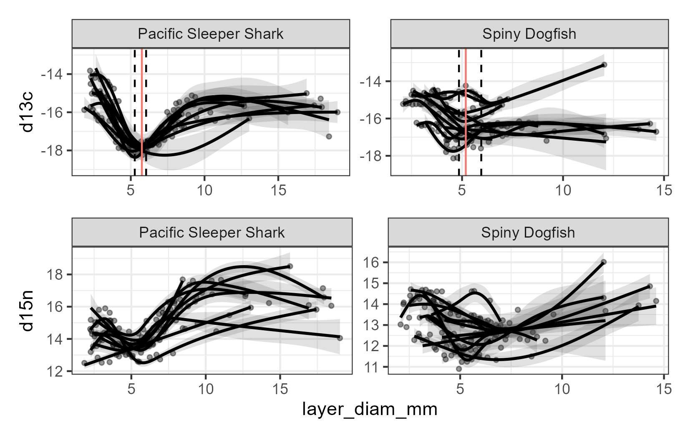

{fig-align="center"}

# Objective

The purpose of this analysis is to estimate body size of Pacific sleeper sharks and Pacific spiny dogfish from images of sequentially peeled eye lenses, based on the presumed linear relationship between eye lens diameter and total body length. The estimation of body size at the time of formation of each lens layer analyzed for delta C-14 and stable isotope composition is intended to facilitate estimation of growth rates and life history reconstruction of individual sharks.

# Introduction

Vertebrate eye lenses grow continuously throughout life, adding sequential layers around an embryonic core over time. Other researchers have demonstrated linear relationships between the fish eye lens diameter and total length, including for the elasmobranchs porbeagle shark *Lamna nasus*, Atlantic spiny dogfish *Squalus acanthias*, thorny skate *Amblyraja radiata*, round ray *Rajella fyllae*, and leopard sharks *Triakis semifasciata* (Quaeck-Davies et al. 2018; Leifsdottir and Campana 2023; Kuntz et al 2025). In this subanalysis, we describe the relationships of whole lens diameter and the diameter of the hardened portion of the lens (i.e., post-apoptotic layers) to the total length of Pacific sleeper sharks *Sominosus pacificus* and Pacific spiny dogfish *Squalus suckleyi* to estimate the total length at the time of formation of each peeled eye layer in order to link delta C-14 and stable isotope values to body size.

# Methods

## Imaging and measurements

Eye lenses were dissected from frozen eye globes and photographed against a 10 x 10 mm grid background to spatially calibrate images for measurements (@fig-F1). For most individuals, a photograph was taken of the whole, intact lens and of the lens following each sequential peel to a small central nucleus. Eye lenses differed in appearance. While the majority of whole lenses were spherical, a few were oblong in shape; many appeared firmer and more opaque, whereas other lenses were surrounded by a clear jelly layer (@fig-F2). Measurements were generally taken through the equator at the widest point of the solid lens, unless the capsule was clearly beginning to delaminate from the rest of the lens. In those cases, the lens was measured where it appeared most spherical (@fig-F3). Some lenses were too irregular to measure. The condition of the lens was noted when taking measurements. All measurements were made using ImagePro v.10-11 (Media Cybernetics) and converted from pixels to mm in R statistical computing software. Images of samples with observations outside the 99% confidence limits of the regressions of the whole lens diameter (*LD~w~*) or first hardened lens diameter (*LD~h~*) on the total length at capture (*TLc*) were re-examined to identify potential measurement errors.

## Comparison of capsule diameter to the diamter of the first hard layer

The outermost layer of the whole lens is termed the “capsule”. Just medial of the capsule is a layer of cuboidal epithelial cells, followed by the pre-apoptotic layers, and then the post-apoptotic hardened layers which are composed of crystalline proteins (Kuntz et al. 2025, Quack-Davies et al. 2018). Studies have suggested that the ratio of the whole lens diameter (*LD~w~*) and the first hardened layer (*LD~h~*) is consistent across the life of the fish, regardless of species (Leiffsdottir and Campana 2023). A regression of the *LD~h~* against the *LD~w~* was conducted by species, and a t-test was performed to determine if the slopes of the lines were significantly different from 1. A slope of 1 would be expected if the *LD~w~* and *LD~h~* increased equally as the eye grows. Similarly, we also examined the relationships of the *LD~h~*:*LD~w~* to total body length at the time of capture (*TL~c~*) and the *LD~h~*:*LD~w~* to *LD~w~*, but tested if those slopes are significantly different from zero. In these cases a slope of zero would be expected if the ratio of *LD~h~*:*LD~w~* was conserved as the eye or fish grows.

## Relationships of *LD~w~* and *LD~h~* to *TL*

Measurement error in *TL~c~* is a known source of uncertainty for this study. Samples were collected from many platforms, likely resulting in inconsistencies in total length measurements. Potential sources of variation include whether the tape measure was placed flat on the deck or over the curve of the body, inability to lay the shark flat due to limited deck space for laying out large specimen, and placement of the caudal fin (in a natural position or flexed). It is not possible to account for this uncertainty and therefore, total length is assumed measured without error for all analyses.

The relationship between *LD~w~* and *TL~c~* was described using separate linear models for each species. The equation followed the form:

$$LD_w = a_i + TL_c*b_i$$

where *i* is the species. The slope and intercept parameters are *b* and *a*, respectively.

Similarly, the relationship between *LD~h~* and *TL~c~* was described using the same equation

$$LD_h = c_i + TL_c*d_i$$

but the slope and intercept parameters were *c* and *d*, respectively. \[NOTE: due to coding, these parameters are still listed as a and b for both models and will be fixed in final editing. See Table 2, which denotes them by *LD~w~* and *LD~h~*\]

## Eye lens diameter at age-0

Kuntz et al. (in review) demonstrate for leopard shark that the the diameter at age-0 can be identified by a significant peak or decline in the stable isotope values occurring after parturition, when the pups transition from maternal nourishment to self-feeding. A genearlized additive model (GAM) was fit to each individual's d13C and d15N data. The first derivative of the d13C models, or when the slope of the model changed from negative to positive, was used to identify the minimum for each individual. A mean layer diameter at the model minimum across individuals is assumed to be a proxy for the hardened lens diameter at birth (with 95% confidence intervals).

Similarly, the first peak of the d15N should also correspond to birth.

## Estimating fish length at the time of layer formation

The above equation can be rewritten to estimate the total length at the time of layer formation (*TL~t~*) following Kuntz et al. (2025):

$$TL_t = (LD_t - a_i,j) / b_i,j$$

where *LD~t~* is the diameter of the lens following each sequential peel and the *a~i,j~* and *b~i,j~* parameters are from Table 2.

Two estimates of *TL~t~* were estimated for each animal, using the *LD~w~* vs *TL* and *LD~h~* vs *TL* model parameters reported in @tbl-LDTL. Uncertainty was estimated based on random draws of the linear regression parameters (n = 1,000, normal distribution around the parameter estimate) and the 2.5th and 97.5th quantiles of the resultant *TL~t~* estimates.

# Results

## Comparison of capsule diameter to the diameter of the first hard layer

```{r set-up}
#| echo: false
#| warning: false
#| output: false
libs <- c("tidyverse", "janitor", "googlesheets4", 'broom', 'patchwork', 'knitr', 'mgcv', 'mvtnorm')

if(length(libs[which(libs %in% rownames(installed.packages()) == FALSE )]) > 0) {
  install.packages(libs[which(libs %in% rownames(installed.packages()) == FALSE)])}
lapply(libs, library, character.only = TRUE)
'%nin%'<-Negate('%in%') #this is a handy function
round_any = function(x, accuracy, f=round){f(x/ accuracy) * accuracy}

# Bring in data from google sheets----
diam_dat <- read_sheet('1xeHWScrJwWkeN_YV-C6euG_7G4w3u7nHjjew34BoSP0', sheet = 'layer_diameter_results') %>% 
  clean_names() %>% 
  select(sample_desc, std_lyr_id, sample_id, specimen_id, species_common_name, length_cm, length_type, methods, 
         new_layer_type, protein_type, layer_diam_mm, image_comments) %>% 
  mutate(length_mm = length_cm * 10)

# capsule diameter vs. first "hard" layer----
# capsule is the whole lens
# first hard layer is after the capsule and "jelly layer" have been removed
# for methods = M15, this is std_lyr_id = XXX_3
# For methods  = M9/10 - M13, it is variable, but should be the same, unless there are only two layers, then take XXX_2

# first pass, use only data from methods = M15 animals
m15dat <- diam_dat %>% 
  filter(methods == 'M15',
         #sample_desc != 'SD embryo eye',
         new_layer_type %in% c('capsule', 'capsule/jelly layer', 'capsule/full eye',
                               'first hard layer', 'first hard layer/nucleus'),
         protein_type %in% c('Insoluble', 'whole layer'),
         !is.na(length_mm),
         image_comments != "oblong") %>% 
  select(!c(sample_desc, methods, image_comments, std_lyr_id, protein_type)) %>% 
  mutate(new_layer_type = case_when(
    str_detect(new_layer_type, 'capsule') ~ 'capsule',
    str_detect(new_layer_type, 'first') ~ 'first_hard_layer'
  )) %>% 
  pivot_wider(names_from = new_layer_type, values_from = layer_diam_mm) %>% 
  clean_names() %>% 
  filter(!is.na(capsule),
         !is.na(first_hard_layer)) %>% 
  mutate(ratio = first_hard_layer/capsule) %>% 
  rename(LDw = capsule,
         LDh = first_hard_layer)
```

```{r diam_lm_models}
#| echo: false
#| warning: false
#| output: false

# lm LDh to LDw----
lm_LDw_LDh <- m15dat %>%
  group_by(species_common_name) %>%
  nest() %>%
  mutate(
    model = map(data, ~ lm(LDh ~ LDw, data = .x)),
    tidy  = map(model, tidy),
    glance = map(model, glance),
    slope_test = map(model, ~ {
      b  <- coef(.x)["LDw"]
      se <- summary(.x)$coefficients["LDw", "Std. Error"]
      t  <- (b - 1) / se
      
      tibble(
        t_stat = t,
        df     = df.residual(.x),
        p_val  = 2 * pt(abs(t), df = df.residual(.x), lower.tail = FALSE)
      )
    })
  )

coef_LDw_LDh <- lm_LDw_LDh %>%
  unnest(tidy) %>%
  left_join(
    lm_LDw_LDh %>% select(species_common_name, slope_test) %>% unnest(slope_test),
    by = "species_common_name"
  ) %>%
  left_join(
    lm_LDw_LDh %>% 
      select(species_common_name, glance) %>% 
      unnest(glance) %>% 
      select(species_common_name, r.squared),
    by = 'species_common_name'
  ) %>% 
  filter(term == "LDw")%>%
  mutate(
    ci_low  = estimate - qt(0.975, df) * std.error,
    ci_high = estimate + qt(0.975, df) * std.error
  )

LDw_LDh <- coef_LDw_LDh %>% 
  transmute(
    species_common_name,
    slope_b = estimate,
    lwr   = ci_low,
    upr   = ci_high,
    se = std.error,
    r2 = r.squared,
    df,
    p_val
  ) %>% 
  mutate(model = 'LDh vs LDw',
         hypothesis = 'mu = 1')
  
# lm ratio to LDw----
lm(ratio ~ LDw, data = m15dat)

lm_ratio_LDw <- m15dat %>%
  group_by(species_common_name) %>%
  nest() %>%
  mutate(
    model = map(data, ~ lm(ratio ~ LDw, data = .x)),
    tidy  = map(model, tidy),
    glance = map(model, glance)
  )

coef_ratio_LDw <- lm_ratio_LDw %>%
  unnest(tidy) %>%
  left_join(
    lm_ratio_LDw %>% 
      select(species_common_name, glance) %>% 
      unnest(glance) %>% 
      select(species_common_name, r.squared, df.residual),
    by = "species_common_name"
  ) %>%
  filter(term == "LDw") %>% 
  mutate(
    ci_low  = estimate - qt(0.975, df.residual) * std.error,
    ci_high = estimate + qt(0.975, df.residual) * std.error
  )

ratio_LDw <- coef_ratio_LDw %>% 
  transmute(
    species_common_name,
    slope_b = estimate,
    lwr   = ci_low,
    upr   = ci_high,
    se = std.error,
    r2 = r.squared,
    df = df.residual,
    p_val = p.value) %>% 
  mutate(model = 'ratio vs LDw',
         hypothesis = 'mu = 0')

# lm of ratio to TL----
lm(ratio ~ length_mm, data = m15dat)

lm_ratio_TL <- m15dat %>%
  group_by(species_common_name) %>%
  nest() %>%
  mutate(
    model = map(data, ~ lm(ratio ~ length_mm, data = .x)),
    tidy  = map(model, tidy),
    glance = map(model, glance)
  )

coef_ratio_TL <- lm_ratio_TL %>%
  unnest(tidy) %>%
  left_join(
    lm_ratio_TL %>% 
      select(species_common_name, glance) %>% 
      unnest(glance) %>% 
      select(species_common_name, r.squared, df.residual),
    by = "species_common_name"
  ) %>%
  filter(term == "length_mm") %>% 
  mutate(
    ci_low  = estimate - qt(0.975, df.residual) * std.error,
    ci_high = estimate + qt(0.975, df.residual) * std.error
  )

ratio_TL <- coef_ratio_TL %>% 
  transmute(
    species_common_name,
    slope_b = estimate,
    lwr   = ci_low,
    upr   = ci_high,
    se = std.error,
    r2 = r.squared,
    df = df.residual,
    p_val = p.value) %>% 
  mutate(model = 'ratio vs TL',
         hypothesis = 'mu = 0')

#LDw to TL----
lm_TL_LDw <- m15dat %>%
  group_by(species_common_name) %>%
  nest() %>%
  mutate(
    model = map(data, ~ lm(length_mm ~ LDw, data = .x)),
    tidy  = map(model, tidy),
    glance = map(model, glance)
  )
coef_TL_LDw <- lm_TL_LDw %>%
  unnest(tidy) %>%
  left_join(
    lm_TL_LDw  %>% 
      select(species_common_name, glance) %>% 
      unnest(glance) %>% 
      select(species_common_name, r.squared, df.residual),
    by = "species_common_name"
  ) %>%
  #filter(term == "length_mm") %>% 
  mutate(
    ci_low  = estimate - qt(0.975, df.residual) * std.error,
    ci_high = estimate + qt(0.975, df.residual) * std.error
  )
TL_LDw <- coef_TL_LDw %>% 
  transmute(
    species_common_name,
    param_name = term,
    param_val = estimate,
    lwr   = ci_low,
    upr   = ci_high,
    se = std.error,
    r2 = r.squared,
    df = df.residual,
    p_val = p.value) %>% 
  mutate(model = 'LDw vs TL')

#LDh to TL----
lm_TL_LDh <- m15dat %>%
  group_by(species_common_name) %>%
  nest() %>%
  mutate(
    model = map(data, ~ lm(length_mm ~ LDh, data = .x)),
    tidy  = map(model, tidy),
    glance = map(model, glance)
  )
coef_TL_LDh <- lm_TL_LDh %>%
  unnest(tidy) %>%
  left_join(
    lm_TL_LDh  %>% 
      select(species_common_name, glance) %>% 
      unnest(glance) %>% 
      select(species_common_name, r.squared, df.residual),
    by = "species_common_name"
  ) %>%
  #filter(term == "length_mm") %>% 
  mutate(
    ci_low  = estimate - qt(0.975, df.residual) * std.error,
    ci_high = estimate + qt(0.975, df.residual) * std.error
  )
TL_LDh <- coef_TL_LDh %>% 
  transmute(
    species_common_name,
    param_name = term,
    param_val = estimate,
    lwr   = ci_low,
    upr   = ci_high,
    se = std.error,
    r2 = r.squared,
    df = df.residual,
    p_val = p.value) %>% 
  mutate(model = 'LDh vs TL')

```

```{r diam_summary}
#| echo: false
#| warning: false
#| output: false

#Summary----
# LDw and LDh summary table
diam_out <- LDw_LDh %>% 
  bind_rows(ratio_LDw, ratio_TL) %>% 
  rename(Species = species_common_name,
         Slope = slope_b,
         Lower = lwr,
         Upper = upr,
         StErr = se,
         Rsq = r2,
         DF = df, 
         Pval = p_val,
         Model = model,
         Hypothesis = hypothesis) %>% 
  mutate(Slope = round(Slope, 4),
         Lower = round(Lower, 4),
         Upper = round(Upper, 4),
         StErr = round(StErr, 4),
         Rsq = round(Rsq, 4),
         Pval = round(Pval, 4),
         Species = if_else(Species == 'Spiny Dogfish', 'SD', 'PSS'))
write_csv(diam_out, paste0(getwd(), "/LDw_vs_LDh.csv"))

nPSSLD <- m15dat %>% 
  filter(species_common_name == 'Pacific Sleeper Shark') %>% 
  count()

nSDLD <- m15dat %>% 
  filter(species_common_name == 'Spiny Dogfish') %>% 
  count()
```

Paired *LD~w~* and *LD~h~* were available from `{r} nPSSLD` Pacific sleeper sharks and `{r} nSDLD` Pacific spiny dogfish with total length recorded at time of capture. The slope of the regression line between *LD~h~* and *LD~w~* was significantly different from 1 (p \< 0.05) for Pacific Sleeper Shark, but not Pacific Spiny Dogfish (@tbl-diam, Model = “LDh vs LDw”, @fig-F4). The slopes of the regression lines of the ratio of *LD~h~*:*LD~w~* relative to the *TL~c~* and relative to the *LD~w~* were significantly different from zero for Pacific sleeper sharks, but not for Pacific spiny dogfish (@tbl-diam, Model = “ratio vs TLc” and “ratio vs LDw”, respectively, @fig-F5).

## Relationship of *LD~w~* and *LD~h~* to *TL*

```{r lm_diam_TL}
#| echo: false
#| warning: false
#| output: false

# add in embryos
embryo_dat <- read_sheet('1kdd8tVNa8AdP8VDm-sxqdtIo95JFA3NotBSdueF618E') %>% 
  clean_names() %>% 
  filter(length_cm > 0) %>% 
  mutate(length_mm = length_cm * 10) %>% 
  select(!c(length_cm, notes)) %>% 
  rename(elength = length_mm, 
         eltype = length_type)

diam_dat <- diam_dat %>% 
  left_join(embryo_dat) %>% 
  mutate(length_mm = coalesce(length_mm, elength),
         length_type = coalesce(length_type, eltype)) %>% 
  select(!c(elength, eltype))

# new data set to be sure to include any samples with only LDw or only LDh
m15dat_v2 <- diam_dat %>% 
  filter(methods == 'M15',
         #sample_desc != 'SD embryo eye',
         new_layer_type %in% c('capsule', 'capsule/preapoptotic', 'capsule/full eye',
                               'first hard layer', 'first hard layer/nucleus'),
         protein_type %in% c('Insoluble', 'whole layer'),
         !is.na(length_mm),
         image_comments != "oblong") %>% 
  select(!c(methods, image_comments, protein_type, std_lyr_id)) %>% 
  mutate(new_layer_type = case_when(
    str_detect(new_layer_type, 'capsule') ~ 'capsule',
    str_detect(new_layer_type, 'first') ~ 'first_hard_layer'
  )) %>% 
  pivot_wider(names_from = new_layer_type, values_from = layer_diam_mm) %>% 
  clean_names() %>% 
  rename(LDw = capsule,
         LDh = first_hard_layer)

# LDh vs TL
lm_TL_LDh <- m15dat_v2 %>%
  group_by(species_common_name) %>%
  nest() %>%
  mutate(
    model = map(data, ~ lm(LDh ~ length_mm, data = .x)),
    tidy  = map(model, tidy),
    glance = map(model, glance)
  )
coef_TL_LDh <- lm_TL_LDh %>%
  unnest(tidy) %>%
  left_join(
    lm_TL_LDh  %>% 
      select(species_common_name, glance) %>% 
      unnest(glance) %>% 
      select(species_common_name, r.squared, df.residual),
    by = "species_common_name"
  ) %>%
  #filter(term == "length_mm") %>% 
  mutate(
    ci_low  = estimate - qt(0.975, df.residual) * std.error,
    ci_high = estimate + qt(0.975, df.residual) * std.error
  )
TL_LDh <- coef_TL_LDh %>% 
  transmute(
    species_common_name,
    param_name = term,
    param_val = round(estimate, 4),
    lwr   = round(ci_low, 4),
    upr   = round(ci_high, 4),
    se = round(std.error, 4),
    r2 = round(r.squared, 4),
    df = df.residual,
    p_val = round(p.value, 4)) %>% 
  mutate(model = 'LDh vs TL')

lm_TL_LDw <- m15dat_v2 %>%
  group_by(species_common_name) %>%
  nest() %>%
  mutate(
    model = map(data, ~ lm(LDw ~ length_mm, data = .x)),
    tidy  = map(model, tidy),
    glance = map(model, glance)
  )
coef_TL_LDw <- lm_TL_LDw %>%
  unnest(tidy) %>%
  left_join(
    lm_TL_LDw  %>% 
      select(species_common_name, glance) %>% 
      unnest(glance) %>% 
      select(species_common_name, r.squared, df.residual),
    by = "species_common_name"
  ) %>%
  #filter(term == "length_mm") %>% 
  mutate(
    ci_low  = estimate - qt(0.975, df.residual) * std.error,
    ci_high = estimate + qt(0.975, df.residual) * std.error
  )
TL_LDw <- coef_TL_LDw %>% 
  transmute(
    species_common_name,
    param_name = term,
    param_val = round(estimate, 4),
    lwr   = round(ci_low, 4),
    upr   = round(ci_high, 4),
    se = round(std.error, 4),
    r2 = round(r.squared, 4),
    df = df.residual,
    p_val = round(p.value, 4))%>% 
  mutate(model = 'LDw vs TL')

LD_TL_out <- TL_LDw %>% 
  bind_rows(TL_LDh) %>% 
  rename(Species = species_common_name,
         Parameter = param_name,
         Value = param_val,
         Lower = lwr,
         Upper = upr,
         StErr = se,
         Rsq = r2,
         DF = df, 
         Pval = p_val,
         Model = model) %>% 
  mutate(Species = if_else(Species == 'Spiny Dogfish', 'SD', 'PSS'),
         Parameter = if_else(Parameter == '(Intercept)', 'a', 'b'))
write.csv(LD_TL_out, paste0(getwd(), '/LD_TL.csv'))

PSSR2 <- LD_TL_out %>% 
  filter(Species == "PSS") %>% 
  select(Rsq) %>% 
  summarise(minR2 = min(Rsq))

SDR2 <- LD_TL_out %>% 
  filter(Species == "SD") %>% 
  select(Rsq) %>% 
  summarise(minR2 = min(Rsq))

PSSw <- m15dat_v2 %>% 
  filter(species_common_name == "Pacific Sleeper Shark",
         !is.na(LDw)) %>% 
  count()

PSSh <- m15dat_v2 %>% 
  filter(species_common_name == "Pacific Sleeper Shark",
         !is.na(LDh)) %>% 
  count()

SDw <- m15dat_v2 %>% 
  filter(species_common_name == "Spiny Dogfish",
         !is.na(LDw)) %>% 
  count()

SDh <- m15dat_v2 %>% 
  filter(species_common_name == "Spiny Dogfish",
         !is.na(LDh)) %>% 
  count()

```

Paired *LD~w~* and *TL~c~* data were available from `{r} PSSw` Pacific sleeper sharks and `{r} SDw` spiny dogfish, while paired *LD~h~* and *TL~c~* data were available from `{r} PSSh` Pacific sleeper sharks and `{r} SDh` spiny dogfish (@tbl-LDTL, @fig-F6). The coefficients of determination (R2) from the regressions of both of the *LD~w~* and *LD~h~* to *TL~c~* for Pacific sleeper shark were \> `{r} PSSR2$minR2`, suggesting that the linear regression explained most of the variability in the data. The R2 of the regressions of both of the *LD~w~* and *LD~h~* to *TL~c~* for Spiny Dogfish were \> `{r} SDR2$minR2`, suggesting that the linear regression explained most of the variability in the data.

## Eye lens diameter at Age-0

```{r age_0_diam}
#| echo: false
#| warning: false
#| output: false

# Bring in data from google sheets----
SIA_dat <- read_sheet('1xeHWScrJwWkeN_YV-C6euG_7G4w3u7nHjjew34BoSP0', sheet = 'SIA_layer_results') %>% 
  clean_names() %>% 
  filter(!is.na(layer_diam_mm))

#note that this approach is simplistic, idea is a model for each animal, find the mean diam at max/min isotopes at small sizes and the 95% CI
#filter out animals with too few samples
samp_n <- SIA_dat %>% 
  group_by(sample_id) %>% 
  summarise(nsamp = length(layer_diam_mm)) %>% 
  filter(nsamp > 5)

#based on preliminary model runs and looking at the data, retain these sample_ids
d13c_keep <- c(273, 420, 473, 504, 507, 508, 544, 
               678, 3643, 44, 50, 57, 61, 604, 800, 3023, 3042,
               3055, 3058, 3066)

#specific layers to remove
drops <- c('3023_12') #layers with non-sensical data returned

mod_dat <- SIA_dat %>% 
  filter(sample_id %in% samp_n$sample_id,
         sample_id %in% d13c_keep,
         std_lyr_id %nin% drops)

#function to run gam on each animal d13c data, then using first derivative, locate the x value at minimum y value
d13c_get_min_ci_deriv <- function(dat, nsim = 1000, n_eval = 200) {
  n_unique <- n_distinct(dat$layer_diam_mm)
  
  # Too few points → no smooth minimum possible
  if (n_unique < 4) {
    return(tibble(
      min_est = NA_real_,
      lower = NA_real_,
      upper = NA_real_,
      boundary = NA
    ))
  }
  
  k_use <- min(6, n_unique - 1)
  
  m <- gam(d13c ~ s(layer_diam_mm, bs = "cr", k = k_use),
           data = dat,
           method = "REML")
  
  # evaluation grid (within individual only)
  grid <- tibble(
    layer_diam_mm = seq(min(dat$layer_diam_mm),
                        max(dat$layer_diam_mm),
                        length.out = n_eval)
  )
  
  # lpmatrix for derivative
  X0 <- predict(m, newdata = grid, type = "lpmatrix")
  eps <- 1e-7
  grid_eps <- grid
  grid_eps$layer_diam_mm <- grid_eps$layer_diam_mm + eps
  X1 <- predict(m, newdata = grid_eps, type = "lpmatrix")
  Xp <- (X1 - X0) / eps   # derivative matrix
  
  # simulate coefficients
  beta_sim <- rmvnorm(nsim, coef(m), vcov(m))
  deriv_sim <- Xp %*% t(beta_sim)
  
  # find - to + zero crossings
  root_locs <- apply(deriv_sim, 2, function(d) {
    idx <- which(diff(sign(d)) == 2)
    if (length(idx) == 0) return(NA_real_)
    grid$layer_diam_mm[idx[1]]
  })
  
  root_locs <- root_locs[!is.na(root_locs)]
  
  if (length(root_locs) == 0) {
    return(tibble(
      min_est = NA_real_,
      lower = NA_real_,
      upper = NA_real_,
      boundary = TRUE
    ))
  }
  
  tibble(
    min_est = median(root_locs),
    lower = quantile(root_locs, 0.025),
    upper = quantile(root_locs, 0.975),
    stdev = sd(root_locs),
    boundary = FALSE
  )
}

d13c_min_results <- mod_dat %>%
  group_by(species_common_name, sample_id) %>%
  group_modify(~ d13c_get_min_ci_deriv(.x)) %>%
  ungroup() %>% 
  group_by(species_common_name) %>% 
  summarise(mean_diam = mean(min_est, na.rm = T),
            sd_diam = mean(stdev, na.rm = T),
            LL_diam = mean(lower, na.rm = T),
            UL_diam = mean(upper, na.rm = T)) %>% 
  ungroup() %>% 
  mutate(isotope = 'd13c')

# get smooth model data
d13c_get_smooth_df <- function(dat, n_eval = 200) {
  n_unique <- n_distinct(dat$layer_diam_mm)
  if (n_unique < 4) return(NULL)
  k_use <- min(6, n_unique - 1)
  m <- gam(d13c ~ s(layer_diam_mm, bs = "cr", k = k_use),
           data = dat,
           method = "REML")
    grid <- tibble(
    layer_diam_mm = seq(min(dat$layer_diam_mm),
                        max(dat$layer_diam_mm),
                        length.out = n_eval)
  )
  preds <- predict(m, newdata = grid, se.fit = TRUE)
  grid %>%
    mutate(
      fit = preds$fit,
      lower = fit - 1.96 * preds$se.fit,
      upper = fit + 1.96 * preds$se.fit
    )
}

d13c_smooth_df <- mod_dat %>%
  group_by(species_common_name, sample_id) %>%
  nest() %>%
  mutate(smooth = map(data, d13c_get_smooth_df)) %>%
  unnest(smooth) %>%
  ungroup()

d13c_min_individual <- mod_dat %>%
  group_by(species_common_name, sample_id) %>%
  group_modify(~ d13c_get_min_ci_deriv(.x)) %>%
  filter(!is.na(min_est)) %>% 
  ungroup()

d13c_summ <- d13c_min_individual %>% 
  group_by(species_common_name) %>% 
  summarise(mean_diam = mean(min_est, na.rm = T),
            #sd_diam = mean(stdev, na.rm = T),
            LL_diam = mean(lower, na.rm = T),
            UL_diam = mean(upper, na.rm = T)) %>% 
  ungroup() %>% 
  mutate(isotope = 'd13c')

dummy15n_results <- d13c_summ %>% 
  mutate(isotope = 'd15n')
age_0_diam <- d13c_summ %>% 
  bind_rows(dummy15n_results)

PSSmdiam <- d13c_summ %>% 
  filter(species_common_name == 'Pacific Sleeper Shark') %>% 
  select(mean_diam) %>% 
  round(., 4)
PSSLLdiam <- d13c_summ %>% 
  filter(species_common_name == 'Pacific Sleeper Shark') %>% 
  select(LL_diam) %>% 
  round(., 4)
PSSULdiam <- d13c_summ %>% 
  filter(species_common_name == 'Pacific Sleeper Shark') %>% 
  select(UL_diam) %>% 
  round(., 4)
SDmdiam <- d13c_summ %>% 
  filter(species_common_name == 'Spiny Dogfish') %>% 
  select(mean_diam) %>% 
  round(., 4)
SDLLdiam <- d13c_summ %>% 
  filter(species_common_name == 'Spiny Dogfish') %>% 
  select(LL_diam) %>% 
  round(., 4)
SDULdiam <- d13c_summ %>% 
  filter(species_common_name == 'Spiny Dogfish') %>% 
  select(UL_diam) %>% 
  round(., 4)
  
# now the same thing for d15n, but looking for first peak
# didn't add the if/then to make this all one function
#function to run gam on each animal d13c data, then using first derivative, locate the x value at minimum y value
d15n_get_max_ci_deriv <- function(dat, nsim = 1000, n_eval = 200) {
  n_unique <- n_distinct(dat$layer_diam_mm)
  
  # Too few points → no smooth minimum possible
  if (n_unique < 4) {
    return(tibble(
      min_est = NA_real_,
      lower = NA_real_,
      upper = NA_real_,
      boundary = NA
    ))
  }
  
  k_use <- min(6, n_unique - 1)
  
  m <- gam(d15n ~ s(layer_diam_mm, bs = "cr", k = k_use),
           data = dat,
           method = "REML")
  
  # evaluation grid (within individual only)
  grid <- tibble(
    layer_diam_mm = seq(min(dat$layer_diam_mm),
                        max(dat$layer_diam_mm),
                        length.out = n_eval)
  )
  
  # lpmatrix for derivative
  X0 <- predict(m, newdata = grid, type = "lpmatrix")
  eps <- 1e-7
  grid_eps <- grid
  grid_eps$layer_diam_mm <- grid_eps$layer_diam_mm + eps
  X1 <- predict(m, newdata = grid_eps, type = "lpmatrix")
  Xp <- (X1 - X0) / eps   # derivative matrix
  
  # simulate coefficients
  beta_sim <- rmvnorm(nsim, coef(m), vcov(m))
  deriv_sim <- Xp %*% t(beta_sim)
  
  # find - to + zero crossings
  root_locs <- apply(deriv_sim, 2, function(d) {
    idx <- which(diff(sign(d)) == -2)
    if (length(idx) == 0) return(NA_real_)
    grid$layer_diam_mm[idx[1]]
  })
  
  root_locs <- root_locs[!is.na(root_locs)]
  
  if (length(root_locs) == 0) {
    return(tibble(
      max_est = NA_real_,
      lower = NA_real_,
      upper = NA_real_,
      boundary = TRUE
    ))
  }
  
  tibble(
    max_est = median(root_locs),
    lower = quantile(root_locs, 0.025),
    upper = quantile(root_locs, 0.975),
    stdev = sd(root_locs),
    boundary = FALSE
  )
}

d15n_min_results <- mod_dat %>%
  group_by(species_common_name, sample_id) %>%
  group_modify(~ d15n_get_max_ci_deriv(.x)) %>%
  ungroup() %>% 
  group_by(species_common_name) %>% 
  summarise(mean_diam = mean(max_est, na.rm = T),
            sd_diam = mean(stdev, na.rm = T),
            LL_diam = mean(lower, na.rm = T),
            UL_diam = mean(upper, na.rm = T)) %>% 
  ungroup() %>% 
  mutate(isotope = 'd15n')

# get smooth model data
d15n_get_smooth_df <- function(dat, n_eval = 200) {
  n_unique <- n_distinct(dat$layer_diam_mm)
  if (n_unique < 4) return(NULL)
  k_use <- min(6, n_unique - 1)
  m <- gam(d15n ~ s(layer_diam_mm, bs = "cr", k = k_use),
           data = dat,
           method = "REML")
  grid <- tibble(
    layer_diam_mm = seq(min(dat$layer_diam_mm),
                        max(dat$layer_diam_mm),
                        length.out = n_eval)
  )
  preds <- predict(m, newdata = grid, se.fit = TRUE)
  grid %>%
    mutate(
      fit = preds$fit,
      lower = fit - 1.96 * preds$se.fit,
      upper = fit + 1.96 * preds$se.fit
    )
}

d15n_smooth_df <- mod_dat %>%
  group_by(species_common_name, sample_id) %>%
  nest() %>%
  mutate(smooth = map(data, d15n_get_smooth_df)) %>%
  unnest(smooth) %>%
  ungroup()

d15n_min_individual <- mod_dat %>%
  group_by(species_common_name, sample_id) %>%
  group_modify(~ d15n_get_max_ci_deriv(.x)) %>%
  ungroup()

d15n_summ <- d15n_min_individual %>% 
  group_by(species_common_name) %>% 
  summarise(mean_diam = mean(max_est, na.rm = T),
            #sd_diam = mean(stdev, na.rm = T),
            LL_diam = mean(lower, na.rm = T),
            UL_diam = mean(upper, na.rm = T)) %>% 
  ungroup() %>% 
  mutate(isotope = 'd15n')


```

TheGAM fits for each individual by species are in @fig-F7. The mean of the first derivative, or localized minima, across all individuals in a species resulted in estimated diameter at age-0 of `{r} PSSmdiam` (`{r} PSSLLdiam`-`{r} PSSLLdiam`, 95% CI) and `{r} SDmdiam` (`{r} SDLLdiam`-`{r} SDLLdiam`, 95% CI) for Pacific sleeper shark and spiny dogfish, respectively. Spiny dogfish are known to be highly mobile, and may move through many regions during the 18-22 month gestation period, which may explain the high variability in the d13C curves. Conversely, while it is unknown exactly where adult Pacific sleeper sharks reside, it is believed that adults of the species generally inhabit the abyssal plain or other deep offshore environments. One current hypothesis is that pregnant females move to nearer to shore to pup and the pups move to shallow nursery areas (e.g., Bering Sea). The consistent valley in d13C across individuals suggests a similar movement pattern at the same size, possibly from the abyssal environment while in utero to a nearshore nursery habitat after pupping.

The d15N data are more variable across individuals in both species. This could be explained by the large size at birth and the generalist/opportunistic feeding strategy following birth. Even though pups are more gape-limited than adults, pups of both species could potentially feed at some of the same trophic levels as the adults. The initial peak of d15N is difficult to identify in most individuals and may be less informative for inferring lens diameter at birth.

## Estimating fish length at the time of layer formation

```{r TLc}
#| echo: false
#| warning: false
#| output: false

# get rid of embryos and pre-apoptotic layers, only estimate for hardened layers. Pull out capsule diameters and add back in later
# capsule diameter should correspond to TL at capture

est_dat <- diam_dat %>% 
  filter(sample_desc != 'SD embryo eye',
    new_layer_type %nin% c('preapoptotic', 'capsule', 'capsule/preapoptotic'))

# set up parameters
params <- LD_TL_out %>% 
  select(Species, Parameter, Value, Model) %>% 
  pivot_wider(names_from = c(Parameter, Model), values_from = Value) %>% 
  mutate(species_common_name = if_else(Species == 'SD', 'Spiny Dogfish', 'Pacific Sleeper Shark')) %>% 
  ungroup() %>% 
  select(!Species) %>% 
  rename(aw = 'a_LDw vs TL',
         ah = 'a_LDh vs TL',
         bw = 'b_LDw vs TL',
         bh = 'b_LDh vs TL')

# estimate lengths
est_dat <- est_dat %>% 
  left_join(params) %>% 
  mutate(LDw_lengthest = (layer_diam_mm - aw)/bw,
         LDh_lengthest = (layer_diam_mm - ah)/bh)

# estimate uncertainty in TL
# set up parameters, same as above, without rounded values
raw_LDw_coef <- coef_TL_LDw %>% 
  transmute(
    species_common_name,
    param_name = term,
    param_val = estimate,
    lwr   = ci_low,
    upr   = ci_high,
    se = std.error,
    df = df.residual)%>% 
  mutate(model = 'LDw vs TL')

raw_LDh_coef <- coef_TL_LDh %>% 
  transmute(
    species_common_name,
    param_name = term,
    param_val = estimate,
    lwr   = ci_low,
    upr   = ci_high,
    se = std.error,
    df = df.residual)%>% 
  mutate(model = 'LDh vs TL')

rawLD_TL_out <- raw_LDw_coef %>% 
  bind_rows(raw_LDh_coef) %>% 
  rename(Species = species_common_name,
         Parameter = param_name,
         Value = param_val,
         Lower = lwr,
         Upper = upr,
         StErr = se,
         DF = df, 
         Model = model) %>% 
  mutate(Species = if_else(Species == 'Spiny Dogfish', 'SD', 'PSS'),
         Parameter = if_else(Parameter == '(Intercept)', 'a', 'b'))

unq_key <- unique(est_dat$std_lyr_id)
TLest <- function(x) {floor((layer_diam_mm - rand_a)/rand_b)}

loop_out <- as.data.frame(matrix(ncol = 7, nrow = length(unq_key)))
colnames(loop_out) <- c("std_lyr_id", "TLw_rand", "lowerCIw", "upperCIw", "TLh_rand", "lowerCIh", "upperCIh")

est_dat2 <- est_dat %>% 
  mutate(Species = if_else(species_common_name == 'Pacific Sleeper Shark', 'PSS', 'SD')) %>% 
  select(std_lyr_id, Species, layer_diam_mm)

for (i in 1:length(unq_key)){
  loopdat <- est_dat2 %>% 
    filter(std_lyr_id == unq_key[i])
  loop_params <- rawLD_TL_out %>% 
    filter(Species == loopdat$Species)
  rand_mat <- as.data.frame(matrix(ncol = 4, nrow = 1000))
  colnames(rand_mat) <- c('aw', 'bw', 'ah', 'bh')
  for (j in 1: nrow(loop_params)){
    rand_val <- rnorm(1000, 
                            mean = loop_params$Value[j],
                            #sd = loop_params$StErr[j] * sqrt(loop_params$DF[j] + 2)),
                            sd = (loop_params$Upper[j] - loop_params$Value[j])/1.96)
    rand_mat[,j] <- rand_val
  }
  rand_mat <- rand_mat %>% 
    mutate(layer_diam_mm = loopdat$layer_diam_mm,
      estTL_w = (layer_diam_mm - aw)/bw,
      estTL_h = (layer_diam_mm - ah)/bh)
  loop_out[i,1]  <- unq_key[i]
  loop_out[i,2] <- round(mean(rand_mat$estTL_w, na.rm = T), 3)
  loop_out[i,3] <- round(quantile(rand_mat$estTL_w, 0.025, na.rm = T), 3)
  loop_out[i,4]  <- round(quantile(rand_mat$estTL_w, 0.975, na.rm = T), 3)
  loop_out[i,5] <- round(mean(rand_mat$estTL_h, na.rm = T), 3)
  loop_out[i,6] <- round(quantile(rand_mat$estTL_h, 0.025, na.rm = T), 3)
  loop_out[i,7]  <- round(quantile(rand_mat$estTL_h, 0.975, na.rm = T), 3)
}

est_dat <- est_dat %>% 
  left_join(loop_out)

write.csv(est_dat, paste0(getwd(), '/TLt_at_layerdiam.csv'))
  
```

The *TL~t~* was estimated for each layer diameter based on the linear regression, with uncertainty (@fig-F8). The *TL~t~* estimates derived from the regression of the *LD~w~* were smaller for both species and resulted in many negative *TL~t~* estimates and many *TL~t~* well below the hypothesized size at birth.

# Discussion

This work illustrates that the type and composition of the layer diameters being used to predict length need to be considered. The ratio of the whole lens diameter to the first hardened layers (or diameter at the first post-apoptotic layer) increases with the size of the eye. It is unclear if this is a function of time or size, or both. The *LD~w~* includes the pre-apoptotic layers and the capsule surrounding the whole lens. The process of apoptosis may occur at different rates throughout the growth trajectory of an animal, resulting in the significant change in the relationship between the *LD~h~* and *LD~w~*. It would be incorrect to make further predictions without considering the different biological processes between the *LD~h~* and *LD~w~*.

The majority of the layer diameter data for this study is from the post-apoptotic layers. For consistency, we recommend using the linear model between the *LD~h~* and *TL~c~* to predict *TL~t~*. The *LD~w~* is representative of the *TL~c~*, not to post-apoptotic processes.

The stable isotope data does not appear to be informative for estimating lens diameter at age-0, but further discussions and interpretations may change this.

# Tables

```{r table1}
#| echo: false
#| warning: false
#| output: true
#| label: tbl-diam
#| tbl-cap: Linear regression model results with the slope, intercept, 95% confidence intervals, standard error, Rsquared, degrees of freedom, t-test p-value at alpha = 0.05, the model and the hypothesis that was tested.

knitr::kable(
  diam_out,
  format = "latex",
  longtable = TRUE,
  booktabs = TRUE
)

```

```{r table2}
#| echo: false
#| warning: false
#| output: true
#| label: tbl-LDTL
#| tbl-cap: Linear regression statistics of the whole lens diameter (*LD~w~*) and the first hardened layer (*LD~h~*) to total length at capture (*TL~c~*) for each species (*i*), with 95% confidence intervals, standard error, Rsquared, degrees of freedom, t-test p-value at alpha = 0.05, and the model (*j*).

knitr::kable(
  LD_TL_out,
  format = "latex",
  longtable = TRUE,
  booktabs = TRUE
)

```

# Figures

{#fig-F1}

{#fig-F2}

{#fig-F3}

```{r Fig4}
#| echo: false
#| warning: false
#| output: false

# uses faceting to separat species
#ggplot(m15dat, aes(x = LDw, y = LDh, color = species_common_name))+
#  geom_point(show.legend = F)+
#  geom_smooth(method = "lm", level = 0.95, show.legend = F)+ # Adds the line and 95% confidence interval
#  geom_abline(slope = 1, intercept = -4, linetype = "dashed")+
#  scale_color_viridis_d(option = "turbo", end = 0.85)+
#  coord_cartesian(xlim = c(0, 20), ylim = c(0, 20))+
#  labs(x = 'Whole Lens Diam (mm)', y = 'First Hardened Layer Diam (mm)')+
#  facet_grid(species_common_name~.)+
#  theme_bw()

#plot might look better with separate species panels
f4_PSSdat <- m15dat %>% 
  filter(species_common_name == 'Pacific Sleeper Shark')

f4_PSS <- ggplot(f4_PSSdat, aes(x = LDw, y = LDh))+
  geom_point()+
  geom_smooth(method = "lm", level = 0.95)+ # Adds the line and 95% confidence interval
  geom_abline(slope = 1, intercept = -4, linetype = "dashed")+
  scale_color_viridis_d(option = "mako", end = 0.85)+
  coord_cartesian(xlim = c(0, 20), ylim = c(0, 20))+
  labs(title = 'Pacific Sleeper Shark', x = 'Whole Lens Diam (mm)', y = 'First Hardened Layer Diam (mm)')+
  #facet_grid(species_common_name~.)+
  theme_bw()

f4_SDdat <- m15dat %>% 
  filter(species_common_name == 'Spiny Dogfish')

f4_SD <- ggplot(f4_SDdat, aes(x = LDw, y = LDh))+
  geom_point()+
  geom_smooth(method = "lm", level = 0.95)+ # Adds the line and 95% confidence interval
  geom_abline(slope = 1, intercept = -4, linetype = "dashed")+
  scale_color_viridis_d(option = "viridis", end = 0.85)+
  coord_cartesian(xlim = c(5, 15), ylim = c(5, 15))+
labs(title = 'Spiny Dogfish', x = 'Whole Lens Diam (mm)', y = 'First Hardened Layer Diam (mm)')+
  #facet_grid(species_common_name~.)+
  theme_bw()

f4 <- f4_PSS/f4_SD + plot_layout(axes = "collect")

ggsave(plot = f4, 
       filename = paste0(getwd(), "/Fig4_LDw_vs_LDh.png"),
       dpi = 300,
       width = 5, height = 4, units = 'in')
```

{#fig-F4}

```{r Fig5}
#| echo: false
#| warning: false
#| output: false

# Calculate R2 values
r2_PSSTL  <- summary(lm(ratio ~ length_mm, data = f4_PSSdat))$r.squared
r2_PSSLDw <- summary(lm(ratio ~ LDw, data = f4_PSSdat))$r.squared
r2_SDTL   <- summary(lm(ratio ~ length_mm, data = f4_SDdat))$r.squared
r2_SDLDw  <- summary(lm(ratio ~ LDw, data = f4_SDdat))$r.squared

# Common theme
pub_theme <- theme_bw(base_size = 14) +
  theme(
    plot.title = element_text(size = 12),
    axis.title = element_text(size = 12),
    panel.grid = element_blank()
  )

f5_PSSTL <- ggplot(f4_PSSdat, aes(length_mm, ratio)) +
  geom_point(size = 2, alpha = 0.7) +
  geom_smooth(method = "lm", se = TRUE, color = "black") +
  annotate("text", x = Inf, y = -Inf,
           label = paste0("R² = ", round(r2_PSSTL, 3)),
           hjust = 1.1, vjust = -0.5, size = 3) +
  labs(title = "Pacific Sleeper Shark",
       x = "Total Length (mm)",
       y = "LDh : LDw") +
  pub_theme

f5_PSSLDw <- ggplot(f4_PSSdat, aes(LDw, ratio)) +
  geom_point(size = 2, alpha = 0.7) +
  geom_smooth(method = "lm", se = TRUE, color = "black") +
  annotate("text", x = Inf, y = -Inf,
           label = paste0("R² = ", round(r2_PSSLDw, 3)),
           hjust = 1.1, vjust = -0.5, size = 3) +
  labs(title = "Pacific Sleeper Shark",
       x = "LDw",
       y = "LDh : LDw") +
  pub_theme

f5_SDTL <- ggplot(f4_SDdat, aes(length_mm, ratio)) +
  geom_point(size = 2, alpha = 0.7) +
  geom_smooth(method = "lm", se = TRUE, color = "black") +
  annotate("text", x = Inf, y = -Inf,
           label = paste0("R² = ", round(r2_SDTL, 3)),
           hjust = 1.1, vjust = -0.5, size = 3) +
  labs(title = "Spiny Dogfish",
       x = "Total Length (mm)",
       y = "LDh : LDw") +
  pub_theme

f5_SDLDw <- ggplot(f4_SDdat, aes(LDw, ratio)) +
  geom_point(size = 2, alpha = 0.7) +
  geom_smooth(method = "lm", se = TRUE, color = "black") +
  annotate("text", x = Inf, y = -Inf,
           label = paste0("R² = ", round(r2_SDLDw, 3)),
           hjust = 1.1, vjust = -0.5, size = 3) +
  labs(title = "Spiny Dogfish",
       x = "LDw",
       y = "LDh : LDw") +
  pub_theme

# Combine panels
f5 <- (f5_PSSTL + f5_PSSLDw) /
      (f5_SDTL + f5_SDLDw) +
      plot_layout(axes = "collect_y")

f5

ggsave(plot = f5, 
       filename = paste0(getwd(), "/Fig5_ratio.png"),
       dpi = 300,
       height = 6)
```

{#fig-F5}

```{r Fig6}
#| echo: false
#| warning: false
#| output: false

f6_PSSdat <- f4_PSSdat %>% 
  select(length_mm, LDw, LDh) %>% 
  pivot_longer(!length_mm, names_to = "type", values_to = 'diam_mm') %>% 
  rename(Layer = type)
  #mutate(Layer = if_else(type == 'LDh', 'FHL', 'Capsule'))
f6_PSS <- ggplot(f6_PSSdat, aes(x = length_mm, y = diam_mm, color = Layer))+
  geom_point()+
  geom_smooth(method = "lm", se = TRUE) +
  scale_color_viridis_d(option = "mako", end = 0.85)+
  labs(title = "Pacific Sleeper Shark", 
       x = 'Total Length (mm)',
       y = 'Layer Diameter (mm)')+
  theme_bw()

f6_SDdat <- m15dat_v2 %>% 
  filter(species_common_name == 'Spiny Dogfish')

f6_SDdat <- f6_SDdat %>% 
  select(length_mm, LDw, LDh) %>% 
  pivot_longer(!length_mm, names_to = "type", values_to = 'diam_mm') %>% 
  rename(Layer = type)
  #mutate(Layer = if_else(type == 'LDh', 'FHL', 'Capsule'))
f6_SD <- ggplot(f6_SDdat, aes(x = length_mm, y = diam_mm, color = Layer))+
  geom_point()+
  geom_smooth(method = "lm", se = TRUE) +
  scale_color_viridis_d(option = "mako", end = 0.85)+
  labs(title = "Spiny Dogfish", 
       x = 'Total Length (mm)',
       y = 'Layer Diameter (mm)')+
  theme_bw()

f6 <- f6_PSS/f6_SD + plot_layout(axes = "collect",
                                 guides = "collect")

ggsave(plot = f6, 
       filename = paste0(getwd(), "/Fig6_LD_TL.png"),
       dpi = 300)
```

{#fig-F6}

```{r Fig7}
#| echo: false
#| warning: false
#| output: false

d13c_age_0_diam <- d13c_summ 

f7a <- ggplot() +
  # raw data
  geom_point(data = mod_dat,
             aes(layer_diam_mm, d13c),
             alpha = 0.4,
             size = 1) +
  
  # smooth CI ribbon
  geom_ribbon(data = d13c_smooth_df,
              aes(layer_diam_mm,
                  ymin = lower,
                  ymax = upper,
                  group = sample_id),
              alpha = 0.15) +
  
  # smooth line
  geom_line(data = d13c_smooth_df,
            aes(layer_diam_mm, fit,
                group = sample_id),
            linewidth = 0.8) +
  
  # vertical lines at mean min-y value
  geom_vline(data = d13c_age_0_diam, aes(xintercept = mean_diam, color = 'black'), show.legend = F)+
  geom_vline(data = d13c_age_0_diam, aes(xintercept = LL_diam), color = 'black', linetype = 'dashed', show.legend = F)+
  geom_vline(data = d13c_age_0_diam, aes(xintercept = UL_diam), color = 'black', linetype = 'dashed', show.legend = F)+
  #geom_vline(data = d13c_min_individual, aes(xintercept = min_est), color = 'red', linetype = 'dashed', show.legend = F)+
  
  facet_wrap(.~ species_common_name, scales = 'free') +
  theme_bw()

d15n_age_0_diam <- d15n_summ
f7b <- ggplot() +
  # raw data
  geom_point(data = mod_dat,
             aes(layer_diam_mm, d15n),
             alpha = 0.4,
             size = 1) +
  
  # smooth CI ribbon
  geom_ribbon(data = d15n_smooth_df,
              aes(layer_diam_mm,
                  ymin = lower,
                  ymax = upper,
                  group = sample_id),
              alpha = 0.15) +
  
  # smooth line
  geom_line(data = d15n_smooth_df,
            aes(layer_diam_mm, fit,
                group = sample_id),
            linewidth = 0.8) +
  
  # vertical lines at mean min-y value
  #geom_vline(data = d15n_age_0_diam, aes(xintercept = mean_diam, color = 'black'), show.legend = F)+
  #geom_vline(data = d15n_age_0_diam, aes(xintercept = LL_diam), color = 'black', linetype = 'dashed', show.legend = F)+
  #geom_vline(data = d15n_age_0_diam, aes(xintercept = UL_diam), color = 'black', linetype = 'dashed', show.legend = F)+
  
  facet_wrap(.~ species_common_name, scales = 'free') +
  theme_bw()

f7 <- f7a/f7b + plot_layout(axes = "collect",
                                 guides = "collect")

ggsave(plot = f7, 
       filename = paste0(getwd(), "/Fig7_d13c.png"),
       dpi = 300)
```

{#fig-F7}

```{r Fig8}
#| echo: false
#| warning: false
#| output: false

TL_plotdat <- est_dat %>% 
  select(species_common_name, sample_id, layer_diam_mm, LDw_lengthest, LDh_lengthest, lowerCIw, upperCIw, lowerCIh, upperCIh) %>%
  rename(LDw = LDw_lengthest,
         LDh = LDh_lengthest) %>% 
  pivot_longer(!c(species_common_name, sample_id, layer_diam_mm), 
               names_to = c(".value","model"),
               names_pattern = "(LD|lowerCI|upperCI)(w|h)") %>% 
  rename(TL_est = LD)

#size at birth info for reference lines
tl_birth <- d13c_age_0_diam %>% 
  select(species_common_name) %>% 
  mutate(tlbirth = c(400, 262))

f8 <- ggplot(TL_plotdat, aes(x = layer_diam_mm, y = TL_est, color = model))+
  geom_point()+
  geom_line()+
  geom_errorbar(aes(ymin = lowerCI, ymax = upperCI), show.legend = F)+
  facet_grid(.~species_common_name)+
  scale_color_viridis_d(option = "mako", end = 0.85)+
  labs(y = 'Total Length (mm)',
       x = 'Layer Diameter (mm)')+
  geom_vline(data = d13c_age_0_diam, aes(xintercept = mean_diam, color = 'black'), show.legend = F)+
  geom_vline(data = d13c_age_0_diam, aes(xintercept = LL_diam), color = 'black', linetype = 'dashed', show.legend = F)+
  geom_vline(data = d13c_age_0_diam, aes(xintercept = UL_diam), color = 'black', linetype = 'dashed', show.legend = F)+
    geom_hline(data = tl_birth, aes(yintercept = tlbirth), color = 'black', linetype = 'dashed', show.legend = F)+
  theme_bw()

ggsave(plot = f8, 
       filename = paste0(getwd(), "/Fig8_predTL.png"),
       dpi = 300)
```

{#fig-F8}
