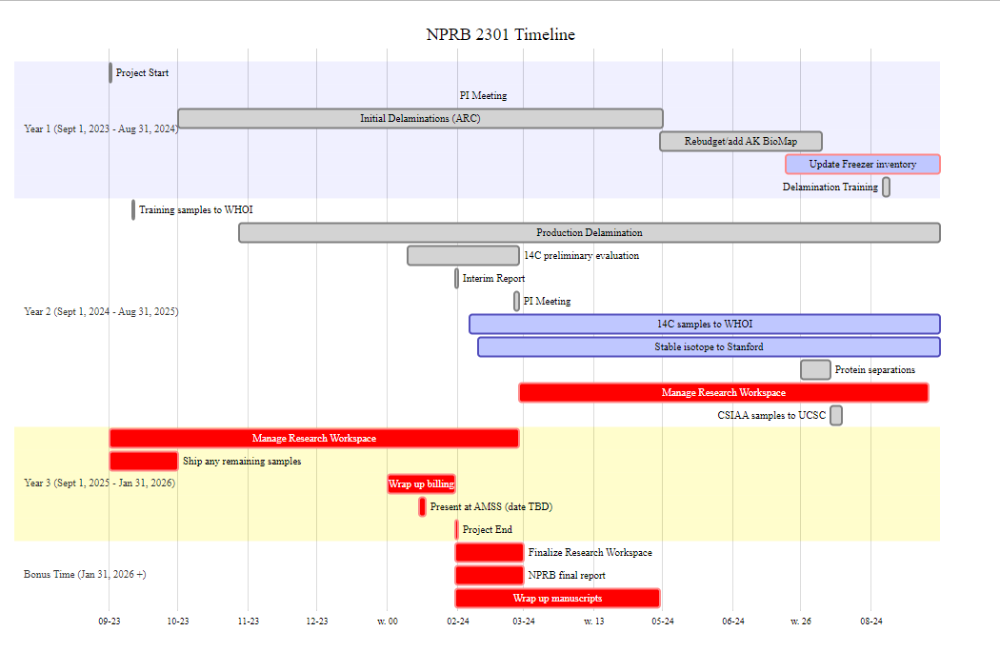
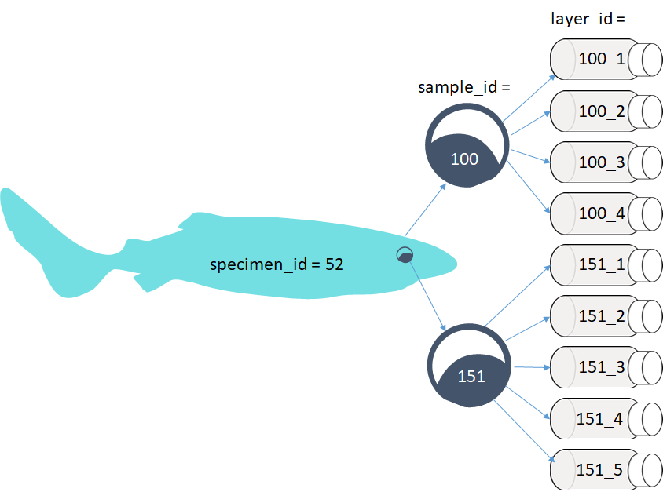

{fig-align="center"}

```{r set-up}
#| echo: false
#| warning: false
#| output: false
libs <- c("tidyverse", "janitor", "googlesheets4", 'DiagrammeR', 'patchwork', 'gtable', 'grid', 'gridExtra')
#, "Hmisc", "RColorBrewer", "gridExtra", "gtable", 
#          "grid", "flextable", "officer", "lubridate", "RODBC", "DBI", "gtable", "patchwork")
if(length(libs[which(libs %in% rownames(installed.packages()) == FALSE )]) > 0) {
  install.packages(libs[which(libs %in% rownames(installed.packages()) == FALSE)])}
lapply(libs, library, character.only = TRUE)
'%nin%'<-Negate('%in%') #this is a handy function
round_any = function(x, accuracy, f=floor){f(x/ accuracy) * accuracy} #note that this is specific to rounding down

roundUpNice <- function(x, nice=c(1,2,4,5,6,8,10)) { #rounds up to handy bin
  if(length(x) != 1) stop("'x' must be of length 1")
  10^floor(log10(x)) * nice[[which(x <= 10^floor(log10(x)) * nice)[[1]]]]
}

spec_dat <- read_sheet('1J3IKrdptj7eS3VZj_qbxXTXorgktHXnQ_gUv1mVaxwk') %>% clean_names() %>% 
  mutate(rank = replace_na(rank, 0))

samp_spec_join <- read_sheet('1pbSRX_9vj3Xe3_vqK_psvamk18oGSH3Kb-R6NeVSQkc', sheet = 'Sample_Join') %>% clean_names()

layer_dat <- read_sheet('1j-TdYjQsN56HmBb07apldWv-TvOh1S_9T3oP6LuKoHU') %>% clean_names() %>% 
  select(sample_id, ams_id, layer_type, layer_order, methods, vial_mt_g, vial_dry_samp_g, layer_diam_mm,
         wt_to_nosams_mg, f_modern, fm_err, wt_to_sia_mg, cn_ratio, wt_to_csiaa) %>% 
  left_join(samp_spec_join)

```

This report summarizes the samples available for NPRB 2301, their status and the status of laboratory processes. Updates will be made available whenever significant updates to the sample database or analytical data become available.

# Version Notes

-   Updated diameter and sample submission information ([NPRB2301_layer_results](https://docs.google.com/spreadsheets/d/1xeHWScrJwWkeN_YV-C6euG_7G4w3u7nHjjew34BoSP0/edit?gid=1357910555#gid=1357910555)), NOTE: the updated diameters are for samples that have not been submitted for 14C, SIA or CSIAA yet, thus will not pre reflected in the NPRB2301_layer_results
-   Added in columns for the diameter notes and CSIAA (no results yet for CSIAA) to the output ([NPRB2301_layer_results](https://docs.google.com/spreadsheets/d/1xeHWScrJwWkeN_YV-C6euG_7G4w3u7nHjjew34BoSP0/edit?gid=1357910555#gid=1357910555))
-   Batch of samples submitted for CSIAA, 14C and SIA, including three large PSS with many layers and diameters
-   Sample selection for protein separation
-   Fixed the "samples remaining in the budget" to reflect the samples from 2019 which were paid for with other funds and do not count against current budgets

# Links and Resources

-   [github repo](https://github.com/CindyTribuzio-NOAA/PSS_Ageing) (public)
-   [Research Workspace](https://www.researchworkspace.com/login) (password protected)
-   [Google Folder](https://drive.google.com/drive/folders/1xsjlj4UVk1kSxjrBIXrRbMp6OHLY9GhE) (access controlled)

# Project Timeline (not updated)



# Specimen, Sample and Layer Summaries

-   Each animal has a specimen_ID. The exception is spiny dogfish embryos, which are considered samples taken of the adult.
-   Each eye, embryo, spine, etc. has a unique sample_id, which links back to the specimen_id that that sample was taken from.
-   Each eye is further separated into layers and each layer_id links back to the sample_id (and thus, specimen_id).Layers are numbered sequentially from the outside towards the center. Early numbering convention used "N" for nucleus, and "R" for the remainder.
-   Embryo each have a sample_id, but two eyes. Each eye and/or layer is labeled with the sample_id, L or R and layer number (as applicable).



```{r changing-parameters, echo = F}

```

## Pacific sleeper sharks

```{r PSS_summary, echo = F}
#| echo: false
#| warning: false
#| output: false
PSS_dat <- spec_dat %>% 
  filter(species_common_name == "Pacific Sleeper Shark",
         !is.na(length_cm),
         !is.na(noncon_lat)|!is.na(nmfs_area))

nPSS <- nrow(PSS_dat)
nPSSeyes <- PSS_dat %>% 
  select(c(eye_l, eye_r)) %>% 
  sum(na.rm = T)
PSS_layer_dat <- layer_dat %>% 
  left_join(samp_spec_join) %>% 
  left_join(spec_dat) %>% 
  filter(species_common_name == "Pacific Sleeper Shark")
nPSSdelam <- length(unique(PSS_layer_dat$specimen_id))
nPSSgoodeye <- PSS_layer_dat %>% 
  filter(methods != "M9/M10") %>% 
  group_by(specimen_id) %>% 
  summarise(n = length(sample_id)) %>% 
  nrow()
nPSSlayers <- PSS_layer_dat %>% 
  filter(methods != "M9/M10") %>% 
  group_by(specimen_id) %>% 
  summarise(n = length(sample_id))
nPSSlayers <- sum(nPSSlayers$n)

spec_ams <- PSS_layer_dat %>% 
  filter(methods != "M9/M10") %>% 
  group_by(specimen_id, sample_id) %>% 
  summarise(nlayers = length(f_modern),
            fmodsum = sum(f_modern, na.rm = T)) %>% 
  mutate(ams_results = if_else(fmodsum >0, "Y", "N")) %>% 
  filter(ams_results == "Y") %>% 
  group_by(specimen_id) %>% 
  summarise(n_ams = length(ams_results))

spec_delam <- PSS_layer_dat %>% 
  filter(methods != "M9/M10") %>% 
  group_by(specimen_id, sample_id) %>% 
  summarise(nlayers = length(f_modern)) %>% 
  group_by(specimen_id) %>% 
  summarise(n_delam = length(sample_id))

graph_dat <- spec_dat %>% 
  filter(species_common_name == "Pacific Sleeper Shark",
         !is.na(length_cm)) %>% 
  left_join(spec_delam) %>% 
  left_join(spec_ams) %>% 
  select(specimen_id, length_cm, length_type, n_delam, n_ams, rank) %>% 
  mutate(l_bin = round_any(length_cm, 10))

all_spec <- graph_dat %>% 
  group_by(l_bin, rank) %>% 
  summarise(n_sharks = length(length_cm))

y_max <- all_spec %>% 
  group_by(l_bin) %>% 
  summarise(bin_max = sum(n_sharks))
y_max <- max(y_max$bin_max)

all_spec_fig <- ggplot(all_spec, aes(x = l_bin, y = n_sharks, fill = as.factor(rank)))+
  geom_bar(stat = "identity", position = 'stack')+
  coord_cartesian(ylim = c(0,roundUpNice(y_max)), xlim = c(0, 500), expand = F)+
  labs(x = "Length Bin", y = "No. Sharks", title = "All Specimens", fill = "Rank")

ams_spec<- graph_dat %>%
  #add_row(specimen_id = 0, length_cm = 0, length_type= 'Total Length', n_delam = 0, n_ams = 0, rank = 0, l_bin = 0) %>%
  filter(!is.na(n_ams)) %>% 
  group_by(l_bin, rank) %>% 
  summarise(n_sharks = length(length_cm))%>% 
  mutate(n_sharks = if_else(rank == 0, 0, n_sharks))

ams_spec_fig <- ggplot(ams_spec, aes(x = l_bin, y = n_sharks, fill = as.factor(rank)))+
  geom_bar(stat = "identity", position = 'stack')+
    coord_cartesian(ylim = c(0,roundUpNice(y_max)), xlim = c(0, 500), expand = F)+
  labs(x = "Length Bin", y = "No. Sharks", title = "AMS Specimens", fill = "Rank")

delam_spec <- graph_dat %>% 
  #add_row(specimen_id = 0, length_cm = 0, length_type= 'Total Length', n_delam = 0, n_ams = NA, rank = 0, l_bin = 0) %>% 
  filter(!is.na(n_delam)) %>% 
  group_by(l_bin, rank) %>% 
  summarise(n_sharks = length(length_cm))%>% 
  mutate(n_sharks = if_else(rank == 0, 0, n_sharks))

delam_spec_fig <- ggplot(delam_spec, aes(x = l_bin, y = n_sharks, fill = as.factor(rank)))+
  geom_bar(stat = "identity", position = 'stack',)+
    coord_cartesian(ylim = c(0,roundUpNice(y_max)), xlim = c(0, 500), expand = F)+
  labs(x = "Length Bin", y = "No. Sharks", title = "Delaminated Specimens", fill = "Rank")

rem_spec  <- graph_dat %>% 
  add_row(specimen_id = 0, length_cm = 0, length_type= 'Total Length', n_delam = NA, n_ams = NA, rank = 1, l_bin = 0) %>% 
  filter(is.na(n_delam)) %>% 
  group_by(l_bin, rank) %>% 
  summarise(n_sharks = length(length_cm)) %>% 
  mutate(n_sharks = if_else(rank == 1, 0, n_sharks))

remaining_spec_fig <- ggplot(rem_spec, aes(x = l_bin, y = n_sharks, fill = as.factor(rank)))+
  geom_bar(stat = "identity", position = 'stack')+
    coord_cartesian(ylim = c(0,roundUpNice(y_max)), xlim = c(0, 500), expand = F)+
  labs(x = "Length Bin", y = "No. Sharks", title = "Remaining Specimens", fill = "Rank")

pr_dat <- PSS_dat %>% 
  mutate(n_eyes = eye_l + eye_r) %>% 
  filter(n_eyes == 2) %>% 
  left_join(spec_delam) %>% 
  left_join(spec_ams) %>% 
  select(specimen_id, length_cm, n_eyes, n_delam, n_ams) %>% 
  mutate(l_bin = round_any(length_cm, 10),
         rem_eye = if_else(!is.na(n_delam), n_eyes - n_delam, 2),
         category = if_else(rem_eye == 2, "None",
                            if_else(rem_eye == 1, "One", "Both"))) %>% 
  group_by(l_bin, category) %>% 
  summarise(tot_prs = length(n_eyes))
```

The below table only includes specimens with both length and haul data. There are some samples without haul data, and some without length. As data gaps get filled in, these numbers will change. Please request any other data breakdowns for future reports.

| N PSS      | N PSS eyes     | N PSS Delaminated | N PSS Layers     |
|------------|----------------|-------------------|------------------|
| `{r} nPSS` | `{r} nPSSeyes` | `{r} nPSSgoodeye` | `{r} nPSSlayers` |

For the purposes of the below graphs, all unknown length types are treated as Total Length until we resolve how to determine that. Ranks are from 1 (lowest) to 4 (highest) and described [here](https://docs.google.com/spreadsheets/d/1i5Q1b6F8m9RK7l_L5-5fmbTkJq1hisUn8w2dwogeTPs/edit?gid=0#gid=0). Rank = 1 are samples that had poor handling and may have thawed before delamination, Rank = 2 are collections with missing length or haul data, but do have at least a "source" (being who provided the sample), Rank = 3 are collections with complete data, but some uncertainties (i.e., length type), and Rank = 4 are survey collections with best chain of custody and full data available. Many specimens have not yet been attributed to a "source" in the database, this is intentional. Many of the at-sea observer provided samples did not have full data with the sample, or deck forms submitted. Some of these data gaps will be filled as we dig through at-sea observer databases, and those specimens will change from rank = 0 to the appropriate rank 1 - rank 4 value.

```{r}
#| echo: false
#| warning: false
#| fig-asp: .7
#| out-width: 95%
#| fig-width: 8.142857

#out2fig = function(out.width, out.width.default = 0.7, fig.width.default = 6) {
#  fig.width.default * out.width / out.width.default 
#} #helpful function for figuring out height/widths (https://arelbundock.com/posts/quarto_figures/index.html)
#out2fig(0.3)

all_spec_fig + delam_spec_fig + ams_spec_fig + remaining_spec_fig+ plot_layout(ncol = 1, guides = "collect", axis_titles = "collect")

```

```{r}
#| echo: false
#| warning: false
#| fig-asp: 0.3
#| out-width: 95%
#| fig-width: 8.142857
#| out-height: 30%
#| fig-height: 2.571429

ggplot(pr_dat, aes(x = l_bin, y = tot_prs, fill = category))+
  geom_bar(stat = "identity", position = 'stack')+
  labs(x = "Length Bin", y = "No. Sharks", title = "Paired Eye Specimens Delaminated", fill = "")
```

## Spiny dogfish

```{r}
#| echo: false
#| warning: false
#| output: false
SD_dat <- spec_dat %>% 
  filter(species_common_name == "Spiny Dogfish")
nSD <- length(unique(SD_dat$specimen_id))
nSD_wdat <- SD_dat %>% 
  filter(!is.na(length_cm)) 
nSD_wdat <- length(unique(nSD_wdat$specimen_id))

nSD_delam <- SD_dat %>% 
  filter(!is.na(length_cm)) %>% 
  left_join(layer_dat) %>% 
  filter(methods != "M9/M10") #filter is for potentialy contaminated samples
nSD_avail <- length(unique(nSD_delam$specimen_id))

nSD_wodat <- SD_dat %>% 
  filter(is.na(length_cm),
         !is.na(embryo_1))
nSD_wodatavail <- length(unique(nSD_wodat$specimen_id))
```

| N SD | N SD with full data | N SD available | N SD with samples but no length |
|------------------|------------------|------------------|-------------------|
| `{r} nSD` | `{r} nSD_wdat` | `{r} nSD_avail` | `{r} nSD_wodatavail` |

This section has not been updated, pending new samples arriving from BC and Washington. Stay tuned.

# Carbon 14

```{r}
#| echo: false
#| warning: false
#| output: false

nAMS <- layer_dat %>% 
  filter(!is.na(f_modern))
nAMS <- length(nAMS$ams_id)
nsent<- layer_dat %>% 
  filter(!is.na(wt_to_nosams_mg),
         methods %nin% c('M1', 'M2', 'M3', 'M4', 'M5', 'M6', 'M7', 'M8'))
nsent <- length(nsent$ams_id)

summ_dat <- read_sheet('1xeHWScrJwWkeN_YV-C6euG_7G4w3u7nHjjew34BoSP0')

nPSS14C <- summ_dat %>% 
  group_by(species_common_name, specimen_id) %>% 
  summarise(n_layers = length(sample_id)) %>% 
  filter(species_common_name == 'Pacific Sleeper Shark') %>% 
  nrow()

nSD14C <- summ_dat %>% 
  group_by(species_common_name, specimen_id) %>% 
  summarise(n_layers = length(sample_id)) %>% 
  filter(species_common_name == 'Spiny Dogfish') %>% 
  nrow()


# get the below info from Taylor as needed
NOSAMS_start <- 150080 #starting funds at WHOI for 14C samples
NOSAMS_rate <- 268 #WHOI rate per 14C sample
Nstart <- NOSAMS_start/NOSAMS_rate
NOSAMS_used <- NOSAMS_rate*nAMS #not used, current balance of WHOI budget, but not updated
NOSAMS_sampleft <- (NOSAMS_start - NOSAMS_used)/NOSAMS_rate
```

The estimated N 14C samples left per budget reflects those that have been billed, not all of the samples that have been submitted.

| N 14C sent  | N 14C returned | N 14C samples left per budget | Total N budgeted |
|----------------|----------------|--------------------------|----------------|
| `{r} nsent` | `{r} nAMS`     | `{r} NOSAMS_sampleft`         | `{r} Nstart`     |

The below table summarizes the number of each species which have 14C results from at least one layer

| N 14C PSS     | N 14C SD     |
|---------------|--------------|
| `{r} nPSS14C` | `{r} nSD14C` |

14C results can be found in [NPRB2301_layer_results](https://docs.google.com/spreadsheets/d/1xeHWScrJwWkeN_YV-C6euG_7G4w3u7nHjjew34BoSP0/edit?gid=1357910555#gid=1357910555).

| Date Sent     | N layers sent | N layers returned |
|---------------|---------------|-------------------|
| Mar 25, 2019  | 11            | 11                |
| Aug 5, 2019   | 8             | 8                 |
| Sept 11, 2024 | 36            | 35                |
| Feb 6, 2025   | 70            | 70                |
| Mar 31, 2025  | 96            | 95                |
| Apr 28, 2025  | 50            | 50                |
| July 14, 2025 | 68            | 0                 |

# Stable Isotopes

```{r}
#| echo: false
#| warning: false
#| output: false

#nSIA <- layer_dat %>% 
#  filter(!is.na(wt_to_sia_mg))
#nSIA <- length(nSIA$ams_id)
nSIAsent<- layer_dat %>% 
  filter(!is.na(wt_to_sia_mg))
nSIAsent <- length(nSIAsent$ams_id)
nSIA <- layer_dat %>% 
  filter(!is.na(wt_to_sia_mg),
         !is.na(cn_ratio))
nSIA <- length(nSIA$cn_ratio)

# get the below info from Taylor as needed
SIA_rate <- 10
SIA_used <- nSIA*SIA_rate
SIA_start <- 5600
SIA_Nstart <- SIA_start/SIA_rate
SIA_sampleft <- (SIA_start - SIA_used)/SIA_rate
```

| N SIA sent | N SIA returned | N SIA samples left per budget | Total N Budgeted |
|----------------|----------------|-------------------------|----------------|
| `{r} nSIAsent` | `{r} nSIA` | `{r} SIA_sampleft` | `{r} SIA_Nstart` |

| Date Sent     | N layers sent | N layers returned |
|---------------|---------------|-------------------|
| Feb 4, 2025   | 70            | 70                |
| Mar 31, 2025  | 107           | 107               |
| Apr 1, 2025   | 15            | 15                |
| Apr 25, 2025  | 35            | 0                 |
| July 14, 2025 | 68            | 0                 |

Stable isotope results can be found in [NPRB2301_layer_results](https://docs.google.com/spreadsheets/d/1xeHWScrJwWkeN_YV-C6euG_7G4w3u7nHjjew34BoSP0/edit?gid=1357910555#gid=1357910555).

# CSIA-AA

```{r}
#| echo: false
#| warning: false
#| output: false

# no results yet, so don't know what that will look like in layer_data file


# get the below info from Taylor as needed
CSAA_used <- 0
CSAA_start <- 14550
CSAA_rate <- 485
CSAA_Nstart <- CSAA_start/CSAA_rate
CSAA_sampleft <- (CSAA_start - CSAA_used)/CSAA_rate

nCSsent<- layer_dat %>% 
  filter(!is.na(wt_to_csiaa))
nCSsent <- length(nCSsent$ams_id)
#nCS <- layer_dat %>% 
#  filter(!is.na(wt_to_csiaa_mg),
#         !is.na(cn_ratio))
#nCS <- length(nSIA$cn_ratio)
```

NOTE: we have funds for more samples than initially planned. Total sample size is now 30. We will proceed with the plan for the first 20, then discuss how to use the remaining samples. Plan: sequence layers (n=5) from either 507 or 508 (which ever has least layers for AMS) sequence layers (n=5) from 678 core and outer layer (n=2) from 161, 273, 422, 473, and 544

| N CSIA_AA sent | N CSIA_AA returned | N CSIA_AA samples left per budget | Total N Budgeted |
|----------------|----------------|-------------------------|----------------|
| `{r} nCSsent` | 0 | `{r} CSAA_sampleft` | `{r} CSAA_Nstart` |

# Protein Separation

Charlotte, Taylor and Cindy have developed [protocols](https://docs.google.com/document/d/1ImyYcjrZn9WYyd93Z4lyDQU1a0ZJj_SSmgSQs9gH3qc/edit?tab=t.0) for the separation of soluble from insoluble proteins.

Delamination is beginning the week of July 13, 2025 for selected PSS eyes. Spiny dogfish eyes are pending new samples arriving from WA later in July.

# Spiny Dogfish Ageing

Cindy, Beth and Charlotte have concluded preliminary reads of all of the spiny dogfish spines following protocols in [Tribuzio et al. 2017](https://spo.nmfs.noaa.gov/content/mfr/methods-preparation-pacific-spiny-dogfish-squalus-suckleyi-fin-spines-and-vertebrae-and). Those results are available in the [NPRB2301_dogfish_spine_ages_PRELIMINARY](https://docs.google.com/spreadsheets/d/1vSwK6RotLo52VmTlqGsSaYjwvUTYKpq989liY06V87g/edit?gid=1357910555#gid=1357910555). The age estimates follow the estimation methods recommended by [Tribuzio et al. 2010](https://spo.nmfs.noaa.gov/content/age-and-growth-spiny-dogfish-squalus-acanthias-gulf-alaska-analysis-alternative-growth).

The spines are being sent to the WDFW ageing lab, as they are the current authority on ageing spiny dogfish and final age estimates will be provided once WDFW completes their reads.
